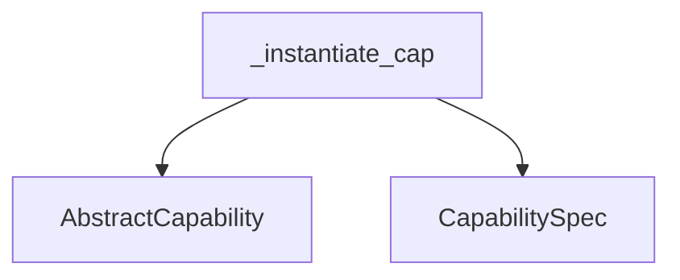

# `agent_capability_init` Module Documentation

## Introduction

The `agent_capability_init` module is a crucial part of the agent definition system, specifically responsible for the dynamic instantiation and validation of agent capabilities. It ensures that capabilities are properly constructed with validated arguments before being utilized by an agent.

## Core Functionality

The primary function of this module is encapsulated in `_instantiate_cap`, which serves as the mechanism for creating instances of `AbstractCapability` based on a provided class and arguments.

### `_instantiate_cap`

**Component ID:** `pydantic_ai_slim.pydantic_ai.agent.__init__._instantiate_cap`

```python
    def _instantiate_cap(
        cap_cls: type[AbstractCapability[Any]],
        args: tuple[Any, ...],
        kwargs: dict[str, Any],
    ) -> AbstractCapability[Any]:
        args, kwargs = validate_from_spec_args(cap_cls, args, kwargs, template_context)
        return cap_cls.from_spec(*args, **kwargs)
```

This function takes the capability class (`cap_cls`), positional arguments (`args`), and keyword arguments (`kwargs`) as input. Before instantiation, it calls `validate_from_spec_args` to ensure that the provided arguments conform to the capability's specification. After validation, it instantiates the capability using the `from_spec` method of the `cap_cls`.

## Architecture and Component Relationships

The `agent_capability_init` module plays a pivotal role within the `agent_definition` sub-module of `pydantic_ai_agent_core`. It acts as an intermediary, taking a capability definition and bringing it to life as an executable instance.

It depends on:
- The `pydantic_ai_capabilities` module for the `AbstractCapability` base class, which all capabilities must inherit from.
- The `capability_spec_definition` module for `CapabilitySpec` and related validation logic, particularly through the `validate_from_spec_args` function, which ensures that capability arguments adhere to predefined schemas.

<!-- DIAGRAM_JSON
{
    "direction": "TD",
    "nodes": [
        {"id": "_instantiate_cap", "label": "_instantiate_cap", "type": "component", "link": null},
        {"id": "abstract_capability", "label": "AbstractCapability", "type": "external", "link": "pydantic_ai_capabilities.md"},
        {"id": "capability_spec", "label": "CapabilitySpec", "type": "external", "link": "capability_spec_definition.md"}
    ],
    "edges": [
        {"source": "_instantiate_cap", "target": "abstract_capability"},
        {"source": "_instantiate_cap", "target": "capability_spec"}
    ],
    "groups": []
}
-->



## How it Fits into the Overall System

This module is integral to the dynamic nature of agents built with Pydantic AI. When an agent is initialized or configured to use a new capability, `_instantiate_cap` is invoked to process the capability definition and create a functional instance. This ensures that agents can flexibly incorporate and manage various tools and functionalities, all while maintaining strict adherence to defined specifications and argument validation. It bridges the gap between a theoretical capability definition and its concrete execution within an agent's runtime environment.
