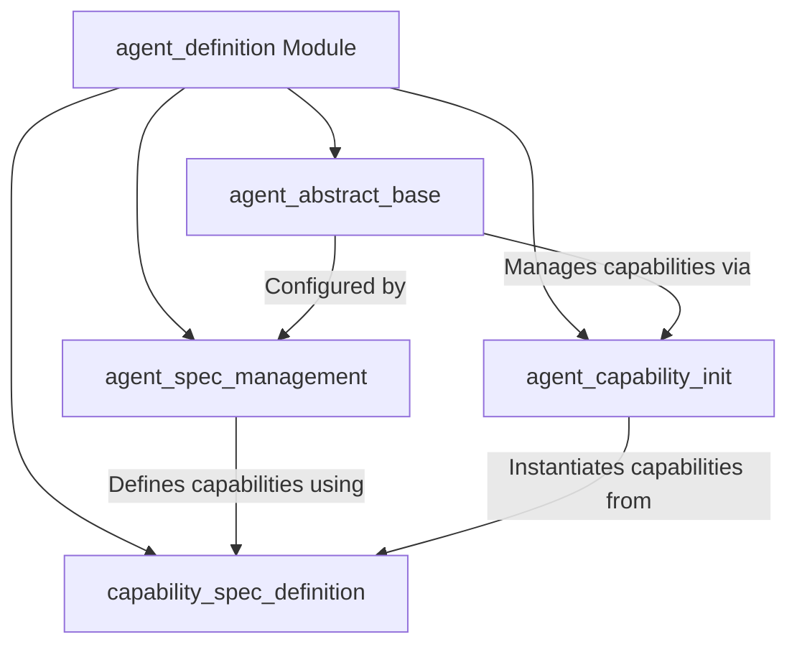

The `agent_definition` module is a foundational component within the `pydantic_ai_agent_core` system, responsible for establishing the core structure, configuration, and capabilities of AI agents. It provides the abstract base for all agent implementations, manages their specifications, and facilitates the dynamic instantiation and validation of their functionalities. This module ensures a consistent and extensible framework for defining diverse agent types.

### Architecture Overview

The `agent_definition` module is composed of several key sub-modules that work in concert to define and manage agents:

### Core Components Documentation

*   **`AbstractAgent`**: Defined in the `agent_abstract_base` module, this is the foundational abstract class that outlines the core interface, execution methods, and behaviors for all AI agents. It serves as a blueprint for concrete agent implementations.
    *   [View `agent_abstract_base` documentation](agent_abstract_base.md)

*   **`AgentSpec`**: Located within the `agent_spec_management` module, `AgentSpec` provides a structured way to define an agent's configuration, including its model, instructions, and a list of capabilities. It supports loading, saving, and validating agent definitions.
    *   [View `agent_spec_management` documentation](agent_spec_management.md)

*   **`CapabilitySpec`**: This specialized specification, found in the `capability_spec_definition` module, is crucial for defining agent capabilities. It acts as a placeholder in JSON schemas, which is expanded into a union of all available capability types during schema generation.
    *   [View `capability_spec_definition` documentation](capability_spec_definition.md)

*   **`_instantiate_cap`**: A utility function within the `agent_capability_init` module, responsible for the dynamic instantiation and validation of agent capabilities. It ensures that capabilities are properly constructed with validated arguments before being used by an agent.
    *   [View `agent_capability_init` documentation](agent_capability_init.md)