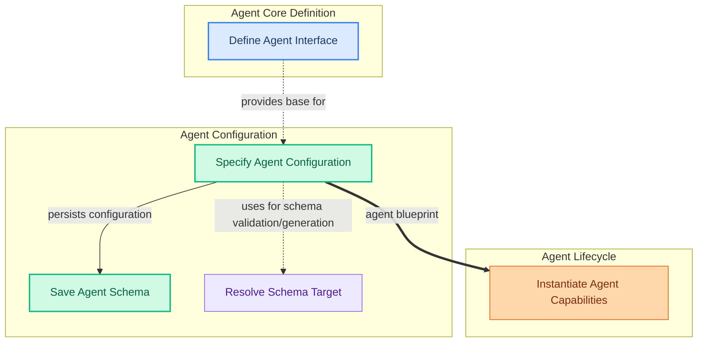

The `agent_definition` module (located at `pydantic_ai_slim/pydantic_ai/agent`) is the foundational layer for creating and managing AI agents within the system. Its primary purpose is to provide the abstract interface for agents, define their structured configuration, and handle the initial instantiation of their capabilities. For users, this module simplifies the process of defining complex AI behaviors by allowing them to specify an agent's model, instructions, and tools through a clear, declarative blueprint. It ensures consistency and reusability across different agent implementations by providing a standardized way to describe an agent's core characteristics and how it comes to life.

### How Components Work Together

The module's components collaborate to establish the agent's identity and prepare it for execution. The `AbstractAgent` sets the fundamental contract that all agents must adhere to. The `AgentSpec` then takes this abstract definition and provides a concrete, serializable configuration for a specific agent, detailing its model, instructions, and the capabilities it possesses. During the agent's setup, `_get_schema_target` assists in dynamically resolving the correct schema for these capabilities, ensuring proper validation and integration. Finally, `_instantiate_cap` uses the `AgentSpec` to bring the agent's defined capabilities into existence, making the agent ready to process requests. The `_save_schema` utility allows for the persistence of these agent configurations, enabling easy sharing and versioning.

### Core Components Documentation

*   **Define Agent Interface**: [`pydantic_ai_slim.pydantic_ai.agent.abstract.AbstractAgent`](pydantic_ai_slim.pydantic_ai.agent.abstract.AbstractAgent.md)
*   **Specify Agent Configuration**: [`pydantic_ai_slim.pydantic_ai.agent.spec.AgentSpec`](pydantic_ai_slim.pydantic_ai.agent.spec.AgentSpec.md)
*   **Save Agent Schema**: [`pydantic_ai_slim.pydantic_ai.agent.spec._save_schema`](pydantic_ai_slim.pydantic_ai.agent.spec._save_schema.md)
*   **Resolve Schema Target**: [`pydantic_ai_slim.pydantic_ai.agent.spec._get_schema_target`](pydantic_ai_slim.pydantic_ai.agent.spec._get_schema_target.md)
*   **Instantiate Agent Capabilities**: [`pydantic_ai_slim.pydantic_ai.agent.__init__._instantiate_cap`](pydantic_ai_slim.pydantic_ai.agent.__init__._instantiate_cap.md)