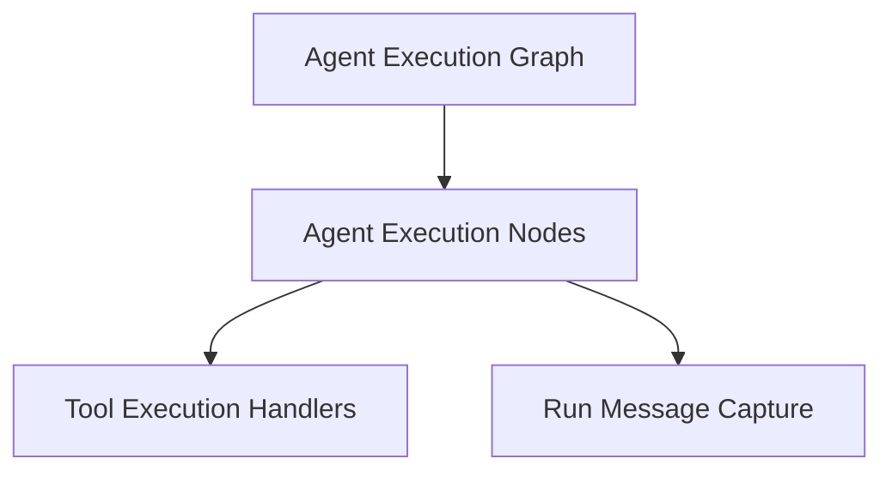

# `agent_execution_graph`

The `agent_execution_graph` module is central to orchestrating the execution flow of an AI agent. It defines the core nodes and mechanisms for processing user prompts, making model requests, handling tool calls, and managing the agent's message history and state.

## Architecture Overview

The module comprises several key sub-modules that work in concert to manage the agent's lifecycle and interactions. The primary nodes (`Agent Execution Nodes`) drive the conversation flow, which can lead to the invocation of external functions or tools managed by the `Tool Execution Handlers`. Throughout this process, the agent's conversational context and messages are managed by the `Run Message Capture` utility.

<!-- DIAGRAM_JSON
{
    "direction": "TD",
    "nodes": [
        {"id": "agent_execution_graph", "label": "Agent Execution Graph", "type": "module", "link": "agent_execution_graph.md"},
        {"id": "agent_nodes", "label": "Agent Execution Nodes", "type": "module", "link": "agent_nodes.md"},
        {"id": "tool_execution_handlers", "label": "Tool Execution Handlers", "type": "module", "link": "tool_execution_handlers.md"},
        {"id": "message_capture", "label": "Run Message Capture", "type": "module", "link": "message_capture.md"}
    ],
    "edges": [
        {"source": "agent_execution_graph", "target": "agent_nodes"},
        {"source": "agent_nodes", "target": "tool_execution_handlers"},
        {"source": "agent_nodes", "target": "message_capture"}
    ],
    "groups": []
}
-->

## Sub-modules

### [Agent Execution Nodes](agent_nodes.md)
This sub-module defines the fundamental building blocks of the agent's execution flow, including `ModelRequestNode` for making requests to language models and `UserPromptNode` for processing user input and initial instructions.

### [Tool Execution Handlers](tool_execution_handlers.md)
This sub-module is responsible for managing the invocation and processing of tool calls. It handles the execution of tools and the subsequent integration of their results back into the agent's message history, allowing the agent to react appropriately to tool outputs or retries.

### [Run Message Capture](message_capture.md)
This sub-module provides utilities for capturing and accessing the ongoing message history of an agent run. It is crucial for maintaining conversational context and for debugging or analyzing agent interactions, especially in scenarios involving errors or complex flows.