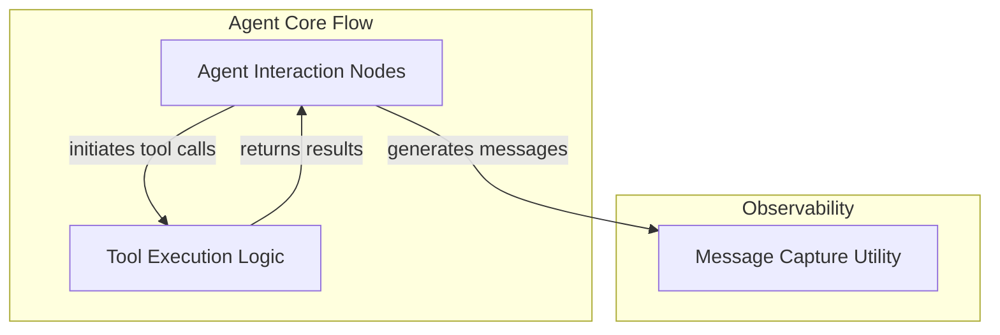

# Agent Execution Graph

The `agent_execution_graph` module is a core component responsible for orchestrating the flow of an AI agent's execution. It defines the nodes within the agent's operational graph, managing interactions with the language model, processing user prompts, and handling tool invocations and their results.

This module is crucial for defining how an agent processes inputs, makes decisions, executes actions via tools, and generates responses, forming the backbone of the agent's operational logic.

## Architecture Overview

The agent execution graph is composed of several key sub-modules that work in concert to manage the agent's runtime behavior:

*   **[Agent Interaction Nodes](agent_interaction_nodes.md)**: Manages the direct interaction nodes within the agent's graph, handling model requests and user prompts.
*   **[Tool Execution Logic](tool_execution_logic.md)**: Manages the execution and results of tool calls initiated by the agent.
*   **[Message Capture Utility](message_capture_utility.md)**: Provides utilities for observing and capturing messages during an agent's run.

<!-- DIAGRAM_JSON
{
    "direction": "TD",
    "nodes": [
        {"id": "agent_interaction_nodes", "label": "Agent Interaction Nodes", "type": "module", "link": "agent_interaction_nodes.md"},
        {"id": "tool_execution_logic", "label": "Tool Execution Logic", "type": "module", "link": "tool_execution_logic.md"},
        {"id": "message_capture_utility", "label": "Message Capture Utility", "type": "module", "link": "message_capture_utility.md"}
    ],
    "edges": [
        {"source": "agent_interaction_nodes", "target": "tool_execution_logic", "label": "initiates tool calls"},
        {"source": "tool_execution_logic", "target": "agent_interaction_nodes", "label": "returns results"},
        {"source": "agent_interaction_nodes", "target": "message_capture_utility", "label": "generates messages"}
    ],
    "groups": [
        {
            "id": "agent_core_flow",
            "label": "Agent Core Flow",
            "role": "generative",
            "nodes": ["agent_interaction_nodes", "tool_execution_logic"]
        },
        {
            "id": "observability",
            "label": "Observability",
            "role": "data",
            "nodes": ["message_capture_utility"]
        }
    ]
}
-->

