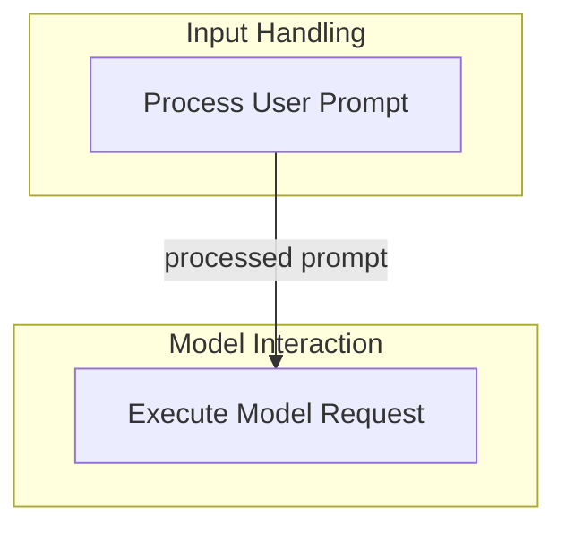

# Agent Interaction Nodes

The `agent_interaction_nodes` module is a fundamental component of the AI agent, defining the core nodes responsible for orchestrating interactions between the agent, the user, and the underlying language models. It provides the structural elements necessary for processing user input and making requests to language models, forming the backbone of the agent's conversational flow and decision-making process.

## Architecture Overview

This module contains two primary nodes:

1.  **User Prompt Node**: Handles initial user input and instructions.
2.  **Model Request Node**: Manages the communication with the language model.

These nodes work in sequence, where user input processed by the `UserPromptNode` typically leads to a model request initiated by the `ModelRequestNode`.

<!-- DIAGRAM_JSON
{
    "direction": "TD",
    "nodes": [
        {
            "id": "agent_interaction_nodes",
            "label": "Agent Interaction Nodes",
            "type": "module"
        },
        {
            "id": "user_prompt_node",
            "label": "Process User Prompt",
            "type": "module",
            "link": "user_prompt_node.md"
        },
        {
            "id": "model_request_node",
            "label": "Execute Model Request",
            "type": "module",
            "link": "model_request_node.md"
        }
    ],
    "edges": [
        {
            "source": "user_prompt_node",
            "target": "model_request_node",
            "label": "processed prompt"
        }
    ],
    "groups": [
        {
            "id": "input_handling",
            "label": "Input Handling",
            "role": "surface",
            "nodes": [
                "user_prompt_node"
            ]
        },
        {
            "id": "model_interaction",
            "label": "Model Interaction",
            "role": "generative",
            "nodes": [
                "model_request_node"
            ]
        }
    ]
}
-->

## Sub-modules

*   ### [User Prompt Node](user_prompt_node.md)

    The `UserPromptNode` is responsible for ingesting and processing user-provided prompts and initial instructions. It prepares the agent's internal message history for a model request, handling deferred tool results and dynamically re-evaluating system prompts based on the current run context. This node ensures that all user input is correctly formatted and integrated before being sent to the language model.

*   ### [Model Request Node](model_request_node.md)

    The `ModelRequestNode` is where the agent interacts directly with the language model. It constructs the model request based on the agent's current state and message history, manages the streaming and non-streaming responses from the model, and handles any tool calls suggested by the model. This node is critical for the agent's ability to generate responses and execute actions.