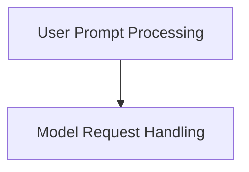

# agent_nodes Module Documentation

The `agent_nodes` module defines the fundamental building blocks (nodes) for constructing and executing agent graphs within the Pydantic AI framework. These nodes represent distinct steps in an agent's operation, handling interactions with the user and the underlying language model.

## Architecture Overview

The `agent_nodes` module is composed of two primary sub-modules:

*   **Model Request Handling**: Manages all aspects of sending requests to the language model and processing its responses.
*   **User Prompt Processing**: Handles the initial user input, instructions, and system prompts, preparing them for the model.

<!-- DIAGRAM_JSON
{
    "direction": "TD",
    "nodes": [
        {"id": "model_request_handling", "label": "Model Request Handling", "type": "module", "link": "model_request_handling.md"},
        {"id": "user_prompt_processing", "label": "User Prompt Processing", "type": "module", "link": "user_prompt_processing.md"}
    ],
    "edges": [
        {"source": "user_prompt_processing", "target": "model_request_handling"}
    ],
    "groups": []
}
-->

## Sub-modules

### [Model Request Handling](model_request_handling.md)

This sub-module encapsulates the logic for interacting with the language model. It handles the creation of model requests, streaming responses, managing retries, and tracking usage. It ensures that model interactions are robust and adhere to defined constraints.

### [User Prompt Processing](user_prompt_processing.md)

This sub-module is responsible for preparing user input and system-level instructions for the language model. It processes initial user prompts, incorporates dynamic system prompts, and handles any deferred tool results, transforming them into a structured format suitable for model consumption.