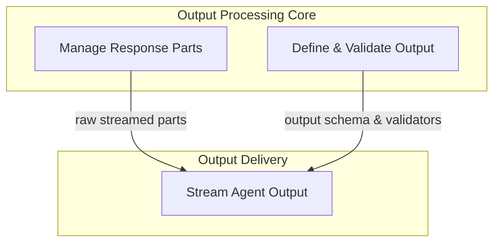

# Agent Output Handling Module

## Introduction and Purpose

The `agent_output_handling` module is a crucial component within the `pydantic_ai_agent_core` responsible for defining, processing, validating, and streaming the outputs generated by AI agents. It provides a robust framework to manage complex response structures, including text, tool calls, and even images, ensuring that agent outputs conform to predefined schemas and are delivered efficiently to the consumer.

This module addresses the challenges of handling diverse and often dynamic agent responses by offering mechanisms for:

*   **Schema Definition**: Allowing developers to specify the expected format and types of agent outputs.
*   **Response Parsing**: Breaking down raw model streams into manageable parts (text, tool calls, thinking steps).
*   **Validation**: Ensuring that generated outputs adhere to defined rules and types before being consumed.
*   **Streaming**: Providing asynchronous interfaces for real-time access to partial or complete agent results.

By centralizing output handling, this module enhances the reliability and usability of AI agents, making it easier to integrate them into larger systems and enabling a consistent experience for downstream applications.

## Architecture Overview

The `agent_output_handling` module is composed of three main sub-modules, each focusing on a distinct aspect of processing and delivering agent outputs:

*   **[Output Definition & Validation](output_definition_and_validation.md)**: Manages the formal specification and validation of agent outputs.
*   **[Model Response Part Management](response_part_management.md)**: Handles the granular, streamed components of a model's response.
*   **[Agent Output Streaming](agent_output_streaming.md)**: Orchestrates the asynchronous delivery and transformation of the agent's final output.

These sub-modules work in concert, with raw model responses being processed by the `Model Response Part Management`, then structured and validated by `Output Definition & Validation`, and finally consumed and exposed through the `Agent Output Streaming` interface.

<!-- DIAGRAM_JSON
{
    "direction": "TD",
    "nodes": [
        {"id": "response_part_management", "label": "Manage Response Parts", "type": "module", "link": "response_part_management.md"},
        {"id": "output_definition_and_validation", "label": "Define & Validate Output", "type": "module", "link": "output_definition_and_validation.md"},
        {"id": "agent_output_streaming", "label": "Stream Agent Output", "type": "module", "link": "agent_output_streaming.md"}
    ],
    "edges": [
        {"source": "response_part_management", "target": "agent_output_streaming", "label": "raw streamed parts"},
        {"source": "output_definition_and_validation", "target": "agent_output_streaming", "label": "output schema & validators"}
    ],
    "groups": [
        {
            "id": "output_processing",
            "label": "Output Processing Core",
            "role": "generative",
            "nodes": ["output_definition_and_validation", "response_part_management"]
        },
        {
            "id": "output_delivery",
            "label": "Output Delivery",
            "role": "surface",
            "nodes": ["agent_output_streaming"]
        }
    ]
}
-->

