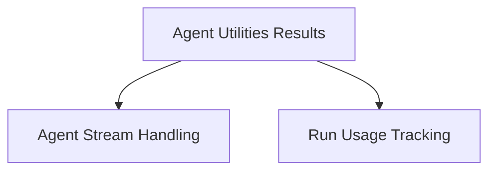

# Agent Results and Streaming

The `agent_results_and_streaming` module is a crucial component within the `pydantic_ai_agent_core` system, specifically under `agent_utilities_results`. It is responsible for managing the asynchronous streaming of agent outputs, validating responses, and tracking resource usage during agent execution. This module ensures that agent responses are delivered efficiently and can be processed and validated in real-time or upon completion.

## Architecture Overview

The `agent_results_and_streaming` module is composed of two primary sub-modules: `agent_stream_handling` and `run_usage_tracking`. It interacts with the broader `agent_utilities_results` for utility functions related to asynchronous operations.

<!-- DIAGRAM_JSON
{
    "direction": "TD",
    "nodes": [
        {"id": "agent_utilities_results", "label": "Agent Utilities Results", "type": "module", "link": "agent_utilities_results.md"},
        {"id": "agent_stream_handling", "label": "Agent Stream Handling", "type": "module", "link": "agent_stream_handling.md"},
        {"id": "run_usage_tracking", "label": "Run Usage Tracking", "type": "module", "link": "run_usage_tracking.md"}
    ],
    "edges": [
        {"source": "agent_utilities_results", "target": "agent_stream_handling"},
        {"source": "agent_utilities_results", "target": "run_usage_tracking"}
    ],
    "groups": []
}
-->

## Sub-modules

### [Agent Stream Handling](agent_stream_handling.md)
This sub-module provides the core functionality for handling agent output streams. It includes mechanisms for asynchronously streaming validated agent outputs and raw model responses, as well as methods for text extraction and output validation. The `AgentStream` class is central to this functionality.

### [Run Usage Tracking](run_usage_tracking.md)
This sub-module is responsible for tracking resource consumption during an agent's execution. While `Usage` is a deprecated alias, it serves to highlight the importance of monitoring the resources utilized by agent runs.
