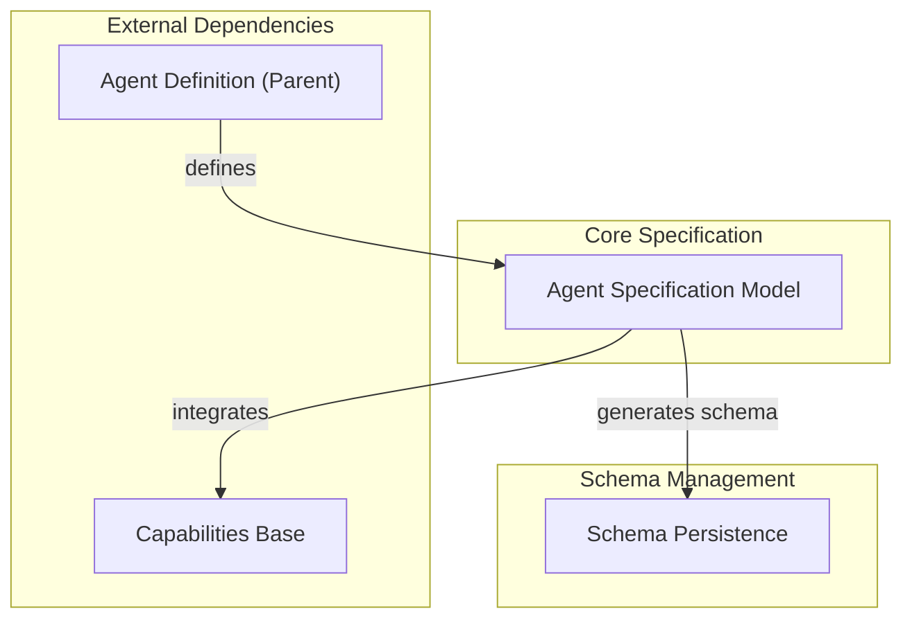

# Agent Spec Definition Module

The `agent_spec_definition` module is central to defining and managing the configuration of AI agents within the `pydantic_ai_slim` framework. It provides the core `AgentSpec` class, a powerful Pydantic model that allows users to precisely specify an agent's behavior, capabilities, and underlying model settings through structured YAML or JSON files. This module streamlines agent creation by enabling declarative configuration and ensuring validation against defined schemas.

## Purpose and Importance

This module acts as the blueprint for AI agents, allowing developers to:
- **Define Agent Structure**: Clearly outline an agent's properties such as its name, description, instructions, and the language model it uses.
- **Manage Capabilities**: Integrate various functionalities (capabilities) into an agent, like tool usage, memory management, or web interaction.
- **Ensure Consistency**: Utilize JSON schema generation to validate agent configuration files, preventing errors and ensuring that agents adhere to a consistent structure.
- **Facilitate Serialization**: Easily load and save agent specifications from and to file formats like YAML and JSON, promoting portability and version control.

## Architecture Overview

The `agent_spec_definition` module is composed of two primary sub-modules that work together to provide its core functionality: the `AgentSpec` model itself and the utilities for persisting its schema.

<!-- DIAGRAM_JSON
{
    "direction": "TD",
    "nodes": [
        {"id": "agent_spec_model", "label": "Agent Specification Model", "type": "module", "link": "agent_spec_model.md"},
        {"id": "schema_persistence", "label": "Schema Persistence", "type": "module", "link": "schema_persistence.md"},
        {"id": "agent_definition", "label": "Agent Definition (Parent)", "type": "external", "link": "agent_definition.md"},
        {"id": "capabilities_base", "label": "Capabilities Base", "type": "external", "link": "capabilities_base.md"}
    ],
    "edges": [
        {"source": "agent_definition", "target": "agent_spec_model", "label": "defines"},
        {"source": "agent_spec_model", "target": "schema_persistence", "label": "generates schema"},
        {"source": "agent_spec_model", "target": "capabilities_base", "label": "integrates"}
    ],
    "groups": [
        {
            "id": "core_spec",
            "label": "Core Specification",
            "role": "data",
            "nodes": ["agent_spec_model"]
        },
        {
            "id": "schema_management",
            "label": "Schema Management",
            "role": "analytical",
            "nodes": ["schema_persistence"]
        },
        {
            "id": "external_dependencies",
            "label": "External Dependencies",
            "role": "surface",
            "nodes": ["agent_definition", "capabilities_base"]
        }
    ]
}
-->

## Sub-modules

### [Agent Specification Model](agent_spec_model.md)
This sub-module provides the `AgentSpec` Pydantic model, which is the foundational class for defining agent configurations. It encapsulates all necessary parameters, such as the AI model to use, agent instructions, and a list of capabilities, allowing for declarative agent definition.

### [Schema Persistence](schema_persistence.md)
This sub-module focuses on the utility for saving the JSON schema of the `AgentSpec`. This is critical for external validation of agent configuration files (e.g., YAML or JSON), ensuring that any custom agent definitions adhere to the expected structure and types.

## Connections to Other Modules

-   **[Agent Definition](agent_definition.md)**: As a child of the `agent_definition` module, `agent_spec_definition` provides the concrete specification for agents that are defined and instantiated within that broader module.
-   **[Capabilities Base](capabilities_base.md)**: The `AgentSpec` integrates with the `capabilities_base` module by referencing `CapabilitySpec` objects, which define the individual capabilities an agent can possess. This allows for a modular and extensible approach to agent functionality.
-   **[Agent Initialization](agent_initialization.md)**: The `AgentSpec` is used by the `agent_initialization` module to `_instantiate_cap` (instantiate capabilities) and build a functional agent from the provided specification.
