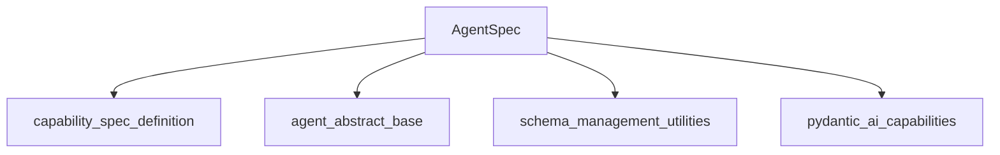

# agent_spec_definition Module Documentation

## Introduction
The `agent_spec_definition` module is a crucial part of the `pydantic_ai_agent_core` package, providing the `AgentSpec` class. This class serves as the blueprint for defining the structure and behavior of AI agents within the system. It allows developers to specify agents using declarative formats like YAML or JSON, promoting clarity, maintainability, and reusability.

## Purpose
The primary purpose of this module is to offer a robust and extensible mechanism for formalizing agent definitions. It enables:
*   **Declarative Agent Configuration**: Define agents in a human-readable and machine-parsable format.
*   **Validation**: Ensure agent specifications adhere to a predefined schema, preventing misconfigurations.
*   **Serialization/Deserialization**: Seamlessly load agent specifications from files or strings and save them back.
*   **Schema Generation**: Generate JSON schemas for `AgentSpec`, facilitating external tooling and validation.

## Core Functionality
The `agent_spec_definition` module's core functionality revolves around the `AgentSpec` class, which encapsulates all necessary parameters to construct an AI agent.

### `AgentSpec` Class
The `AgentSpec` class is a Pydantic `BaseModel` that defines the schema for an AI agent. Key attributes include:
*   `model`: The AI model to be used by the agent.
*   `name`: A descriptive name for the agent.
*   `description`: A brief explanation of the agent's purpose.
*   `instructions`: Detailed instructions guiding the agent's behavior.
*   `deps_schema`: Schema for external dependencies.
*   `output_schema`: Schema for the expected output of the agent.
*   `model_settings`: Specific settings for the chosen AI model.
*   `retries`: Number of retries for operations.
*   `capabilities`: A list of `CapabilitySpec` instances, defining the agent's abilities (e.g., tool usage, memory, web search).

It provides several class methods for instantiation and serialization:
*   `from_file(path, fmt)`: Loads an `AgentSpec` instance from a YAML or JSON file.
*   `from_text(text, fmt)`: Parses a string (YAML or JSON) into an `AgentSpec` instance.
*   `from_dict(data)`: Validates a dictionary against the `AgentSpec` schema.
*   `to_file(path, fmt, schema_path, custom_capability_types)`: Saves the `AgentSpec` instance to a file, optionally generating and saving its JSON schema.
*   `model_json_schema_with_capabilities(custom_capability_types)`: Generates a comprehensive JSON schema for `AgentSpec`, including details for all defined capabilities.

## Architecture and Component Relationships

The `agent_spec_definition` module primarily interacts with other modules to manage the lifecycle and validation of agent specifications.

<!-- DIAGRAM_JSON
{
    "direction": "TD",
    "nodes": [
        {"id": "agent_spec", "label": "AgentSpec", "type": "component", "link": null},
        {"id": "capability_spec_definition", "label": "capability_spec_definition", "type": "external", "link": "capability_spec_definition.md"},
        {"id": "agent_abstract_base", "label": "agent_abstract_base", "type": "external", "link": "agent_abstract_base.md"},
        {"id": "schema_management_utilities", "label": "schema_management_utilities", "type": "external", "link": "schema_management_utilities.md"},
        {"id": "pydantic_ai_capabilities", "label": "pydantic_ai_capabilities", "type": "external", "link": "pydantic_ai_capabilities.md"}
    ],
    "edges": [
        {"source": "agent_spec", "target": "capability_spec_definition"},
        {"source": "agent_spec", "target": "agent_abstract_base"},
        {"source": "agent_spec", "target": "schema_management_utilities"},
        {"source": "agent_spec", "target": "pydantic_ai_capabilities"}
    ],
    "groups": []
}
-->

### Relationships:
*   **`AgentSpec` to `capability_spec_definition`**: `AgentSpec` holds a list of `CapabilitySpec` instances, directly linking it to the definitions of individual capabilities. For more details, refer to the [capability_spec_definition](capability_spec_definition.md) module documentation.
*   **`AgentSpec` to `agent_abstract_base`**: `AgentSpec` defines the blueprint for an agent, which is eventually instantiated into an `AbstractAgent` (or a concrete implementation inheriting from it). This signifies a conceptual "is-a-specification-of" relationship. See the [agent_abstract_base](agent_abstract_base.md) module for more information on the abstract agent definition.
*   **`AgentSpec` to `schema_management_utilities`**: The `AgentSpec` class utilizes internal methods like `_save_schema` and `_get_schema_target`, which are part of the `schema_management_utilities` module, to manage its JSON schema. Refer to [schema_management_utilities](schema_management_utilities.md) for details on schema handling.
*   **`AgentSpec` to `pydantic_ai_capabilities`**: During schema generation (`model_json_schema_with_capabilities`), `AgentSpec` interacts with `AbstractCapability` types, which are defined within the broader [pydantic_ai_capabilities](pydantic_ai_capabilities.md) module, to correctly represent the diverse range of agent capabilities in the generated schema.

## How the Module Fits into the Overall System

The `agent_spec_definition` module acts as the declarative configuration layer for agents within the `pydantic_ai_agent_core` system. It provides the standardized format for defining agent characteristics, which are then parsed and used by the agent instantiation and execution logic. This separation of concerns allows developers to define complex agent behaviors using simple, human-readable specifications, facilitating rapid development and deployment of AI agents. It serves as a foundational element, enabling other modules to understand, validate, and operationalize agent designs.