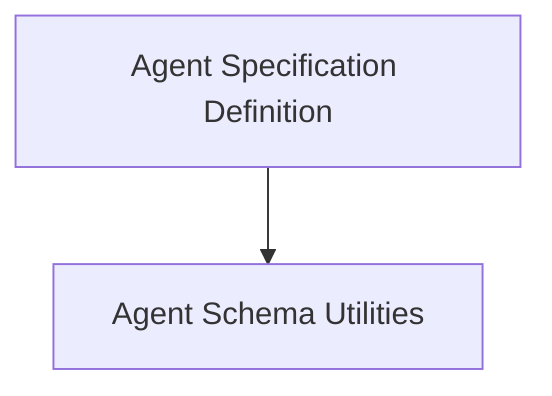

# Agent Spec Management Module

The `agent_spec_management` module is responsible for defining, managing, and persisting the specifications of AI agents. It provides a structured way to define an agent's model, instructions, capabilities, and other configuration parameters, enabling easy creation, loading, and validation of agent definitions.

## Architecture Overview

This module is composed of two primary sub-modules: the `agent_spec_definition` for the core AgentSpec class and the `agent_schema_utilities` for helper functions related to schema management.

<!-- DIAGRAM_JSON
{
    "direction": "TD",
    "nodes": [
        {"id": "agent_spec_definition", "label": "Agent Specification Definition", "type": "module", "link": "agent_spec_definition.md"},
        {"id": "agent_schema_utilities", "label": "Agent Schema Utilities", "type": "module", "link": "agent_schema_utilities.md"}
    ],
    "edges": [
        {"source": "agent_spec_definition", "target": "agent_schema_utilities"}
    ],
    "groups": []
}
-->

## Sub-modules

### Agent Specification Definition
This sub-module defines the `AgentSpec` class, which serves as the blueprint for creating AI agents. It encompasses properties such as the agent's model, name, description, instructions, and a list of capabilities. This class provides methods for loading agent specifications from various formats (YAML, JSON) and saving them to files, along with dynamic JSON schema generation for validation.
For more details, refer to the [agent_spec_definition](agent_spec_definition.md) documentation.

### Agent Schema Utilities
This sub-module contains utility functions primarily for handling the JSON schema generation and retrieval for `AgentSpec` and its related components. It includes methods to save the generated schema to a file and to determine the appropriate target for schema generation.
For more details, refer to the [agent_schema_utilities](agent_schema_utilities.md) documentation.
