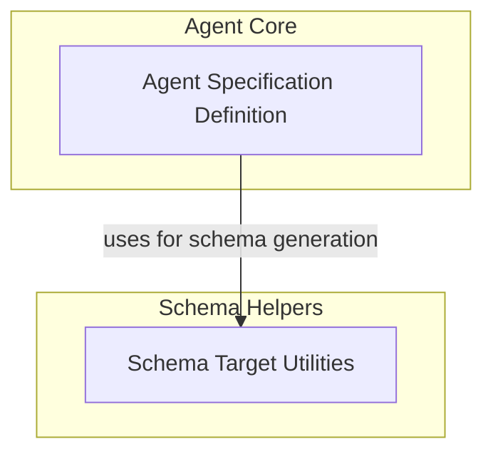

# Agent Specification Module

## Introduction

The `agent_specification` module is a core component responsible for defining, validating, and managing the blueprints for AI agents within the system. It enables developers to create agents from structured specifications (YAML or JSON), ensuring consistency and reusability. This module is critical for the lifecycle of an AI agent, from its initial definition to its deployment and execution.

## Architecture Overview

The `agent_specification` module is structured into key sub-modules that handle the core definition of an agent specification and utilities for schema management. These components work together to provide a robust framework for agent configuration.

<!-- DIAGRAM_JSON
{
    "direction": "TD",
    "nodes": [
        {
            "id": "agent_specification",
            "label": "Agent Specification",
            "type": "module"
        },
        {
            "id": "agent_spec_definition",
            "label": "Agent Specification Definition",
            "type": "module",
            "link": "agent_spec_definition.md"
        },
        {
            "id": "schema_target_utilities",
            "label": "Schema Target Utilities",
            "type": "module",
            "link": "schema_target_utilities.md"
        }
    ],
    "edges": [
        {
            "source": "agent_spec_definition",
            "target": "schema_target_utilities",
            "label": "uses for schema generation"
        }
    ],
    "groups": [
        {
            "id": "agent_core",
            "label": "Agent Core",
            "role": "generative",
            "nodes": [
                "agent_spec_definition"
            ]
        },
        {
            "id": "schema_helpers",
            "label": "Schema Helpers",
            "role": "analytical",
            "nodes": [
                "schema_target_utilities"
            ]
        }
    ]
}
-->

## Sub-modules

### [Agent Specification Definition](agent_spec_definition.md)
This sub-module focuses on the `AgentSpec` class, which serves as the blueprint for defining an AI agent. It includes functionalities for loading agent specifications from files or text, validating them against a defined schema, and saving them to various formats. It also supports dynamic inclusion of custom capabilities within the schema generation.

### [Schema Target Utilities](schema_target_utilities.md)
This sub-module provides utilities primarily concerned with determining the appropriate target for schema generation. It helps in resolving the actual parameter types for capabilities, ensuring that the generated JSON schema accurately reflects the agent's configuration possibilities.
