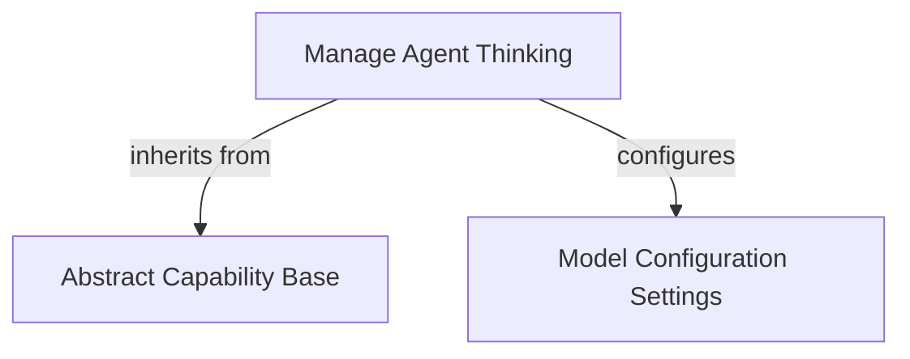

# Agent Thinking Control Module

The `agent_thinking_control` module is responsible for enabling and configuring the agent's thinking and reasoning capabilities within the AI system. It provides a standardized way to control the cognitive effort of underlying language models, ensuring consistent behavior across different model providers.

## How it Works

At its core, this module provides the `Thinking` capability, which allows agents to adjust their reasoning intensity. This is crucial for optimizing performance, managing costs, and tailoring agent behavior to specific tasks. By setting different "thinking levels," developers can fine-tune how much computational effort the agent dedicates to internal reasoning before producing an output or taking an action.

The `Thinking` capability integrates seamlessly with the system's `ModelSettings` to apply these configurations to the chosen language model. It acts as an abstraction layer, allowing a unified `thinking` setting to be used regardless of the specific model provider, while also allowing provider-specific overrides for maximum flexibility.

## Core Components

### Thinking

The `Thinking` class is a concrete implementation of `AbstractCapability` designed to manage the agent's reasoning process.

*   **`effort`**: This attribute, of type `ThinkingLevel`, dictates the intensity of the agent's thinking.
    *   `True`: Enables thinking with the model provider's default effort.
    *   `False`: Disables thinking (this might be silently ignored by models that always perform some level of thinking).
    *   `'minimal'`, `'low'`, `'medium'`, `'high'`, `'xhigh'`: Specifies a distinct effort level for more granular control.
*   **`get_model_settings()`**: This method translates the configured `effort` into a `ModelSettings` object, which is then used to configure the underlying language model.

## Architecture Diagram

<!-- DIAGRAM_JSON
{
    "direction": "TD",
    "nodes": [
        {"id": "thinking_capability", "label": "Manage Agent Thinking", "type": "component", "link": null},
        {"id": "abstract_capability", "label": "Abstract Capability Base", "type": "external", "link": "capabilities_base.md"},
        {"id": "model_settings", "label": "Model Configuration Settings", "type": "external", "link": "model_core_interfaces.md"}
    ],
    "edges": [
        {"source": "thinking_capability", "target": "abstract_capability", "label": "inherits from"},
        {"source": "thinking_capability", "target": "model_settings", "label": "configures"}
    ],
    "groups": []
}
-->
