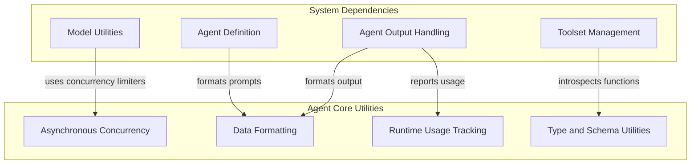

# Agent Utilities Module

The `agent_utilities` module provides a collection of foundational helper functions and classes crucial for the robust operation of agents within the system. These utilities cover asynchronous execution, concurrency management, data formatting, type introspection, and runtime usage tracking. This module aims to simplify common tasks and enforce best practices across various agent implementations, ensuring efficiency, observability, and flexibility.

## Architecture Overview

The `agent_utilities` module is logically divided into several sub-modules, each addressing a specific area of functionality. These sub-modules work in concert to provide a comprehensive set of tools that support the core agent functionalities, including how agents handle concurrency, process data, introspect types for dynamic operations, and track their resource usage.

The following diagram illustrates the internal structure of the `agent_utilities` module and its primary interactions with other key modules in the system.

<!-- DIAGRAM_JSON
{
    "direction": "TD",
    "nodes": [
        {"id": "async_concurrency", "label": "Asynchronous Concurrency", "type": "module", "link": "async_concurrency.md"},
        {"id": "data_formatting", "label": "Data Formatting", "type": "module", "link": "data_formatting.md"},
        {"id": "runtime_usage", "label": "Runtime Usage Tracking", "type": "module", "link": "runtime_usage.md"},
        {"id": "type_and_schema_utilities", "label": "Type and Schema Utilities", "type": "module", "link": "type_and_schema_utilities.md"},
        {"id": "model_utilities", "label": "Model Utilities", "type": "external", "link": "model_utilities.md"},
        {"id": "toolset_management", "label": "Toolset Management", "type": "external", "link": "toolset_management.md"},
        {"id": "agent_definition", "label": "Agent Definition", "type": "external", "link": "agent_definition.md"},
        {"id": "agent_output_handling", "label": "Agent Output Handling", "type": "external", "link": "agent_output_handling.md"}
    ],
    "edges": [
        {"source": "model_utilities", "target": "async_concurrency", "label": "uses concurrency limiters"},
        {"source": "toolset_management", "target": "type_and_schema_utilities", "label": "introspects functions"},
        {"source": "agent_definition", "target": "data_formatting", "label": "formats prompts"},
        {"source": "agent_output_handling", "target": "data_formatting", "label": "formats output"},
        {"source": "agent_output_handling", "target": "runtime_usage", "label": "reports usage"},
        {"source": "agent_utilities", "target": "async_concurrency", "label": "provides"},
        {"source": "agent_utilities", "target": "data_formatting", "label": "provides"},
        {"source": "agent_utilities", "target": "runtime_usage", "label": "provides"},
        {"source": "agent_utilities", "target": "type_and_schema_utilities", "label": "provides"}
    ],
    "groups": [
        {
            "id": "agent_core_utilities",
            "label": "Agent Core Utilities",
            "role": "generative",
            "nodes": ["async_concurrency", "data_formatting", "runtime_usage", "type_and_schema_utilities"]
        },
        {
            "id": "system_dependencies",
            "label": "System Dependencies",
            "role": "data",
            "nodes": ["model_utilities", "toolset_management", "agent_definition", "agent_output_handling"]
        }
    ]
}
-->

## Sub-modules

### [Asynchronous Concurrency](async_concurrency.md)
This sub-module manages asynchronous execution, event loops, and limits concurrent operations to ensure stable performance. It provides core utilities like `run_in_executor` for offloading blocking calls and `ConcurrencyLimiter` for managing resource access.

### [Data Formatting](data_formatting.md)
The `data_formatting` sub-module offers a utility for converting Python objects into XML format, primarily for better readability and structured interaction with Language Models (LLMs) via `format_as_xml`.

### [Runtime Usage Tracking](runtime_usage.md)
This sub-module provides a deprecated alias for `RunUsage`, indicating where runtime resource tracking is handled within the system. It is primarily used for reporting and monitoring agent resource consumption.

### [Type and Schema Utilities](type_and_schema_utilities.md)
The `type_and_schema_utilities` sub-module provides utilities for introspecting function signatures and handling Union types, essential for dynamic schema generation and validation processes, including functions like `_takes_ctx` and `get_union_args`.

## Related Modules

*   **[Model Utilities](model_utilities.md)**: Leverages `agent_utilities` for managing model-specific concurrency limits.
*   **[Toolset Management](toolset_management.md)**: Utilizes type introspection from `agent_utilities` for understanding and validating tool schemas.
*   **[Agent Definition](agent_definition.md)**: May use data formatting utilities for generating structured prompts or configuration.
*   **[Agent Output Handling](agent_output_handling.md)**: Benefits from data formatting for consistent output and integrates with runtime usage tracking for performance metrics.