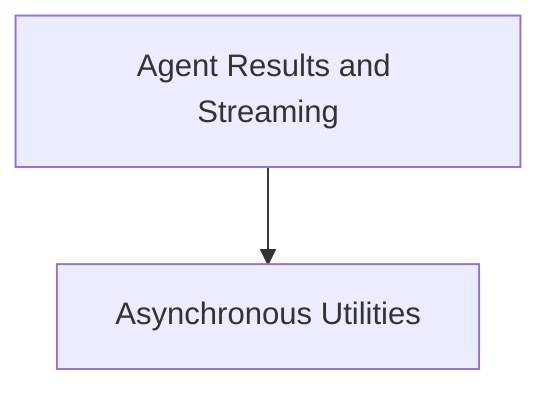

# agent_utilities_results Module Documentation

The `agent_utilities_results` module provides essential utilities and mechanisms for handling agent execution results, including asynchronous operations, stream processing, and usage tracking. It acts as a foundational layer for managing the lifecycle and output of agent interactions within the `pydantic_ai_agent_core` system.

## Architecture Overview

The `agent_utilities_results` module is composed of two primary sub-modules: `async_utilities` for managing asynchronous tasks and basic utility functions, and `agent_results_and_streaming` for handling the core agent output stream and usage reporting.

<!-- DIAGRAM_JSON
{
    "direction": "TD",
    "nodes": [
        {"id": "async_utilities", "label": "Asynchronous Utilities", "type": "module", "link": "async_utilities.md"},
        {"id": "agent_results_and_streaming", "label": "Agent Results and Streaming", "type": "module", "link": "agent_results_and_streaming.md"}
    ],
    "edges": [
        {"source": "agent_results_and_streaming", "target": "async_utilities"}
    ],
    "groups": []
}
-->

## Sub-modules

### [Asynchronous Utilities](async_utilities.md)

This sub-module provides a collection of general-purpose utility functions primarily focused on asynchronous operations, type introspection, and event loop management. These utilities support the broader `pydantic_ai_agent_core` by facilitating concurrent execution and dynamic type handling.

### [Agent Results and Streaming](agent_results_and_streaming.md)

This sub-module is central to managing the output and lifecycle of agent interactions. It encapsulates the functionality for streaming agent responses, performing output validation, and aggregating usage information, ensuring reliable and structured handling of agent results.
