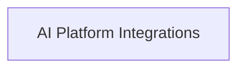

<!-- AUTO_GENERATED_PLACEHOLDER
  reason: LLM did not create .md file for this module
  module_path: pydantic_ai_agent_core/model_provider_configurations/model_provider_integrations/openai_compatible_providers/ai_platform_providers
  component_count: 8
  generated_at: 2026-04-06T06:47:34.933139
  TODO: Fix LLM prompt to handle small leaf modules
-->

# AI Platform Integrations

> ⚠️ **Auto-Generated Placeholder**
> This documentation was auto-generated because the LLM failed to create it.
> Module path: `pydantic_ai_agent_core/model_provider_configurations/model_provider_integrations/openai_compatible_providers/ai_platform_providers`

Connectors for various specialized AI model inference platforms that offer OpenAI-compatible endpoints.

## Components

This module contains 8 component(s):

- `pydantic_ai_slim.pydantic_ai.providers.cerebras.CerebrasProvider`
- `pydantic_ai_slim.pydantic_ai.providers.deepseek.DeepSeekProvider`
- `pydantic_ai_slim.pydantic_ai.providers.fireworks.FireworksProvider`
- `pydantic_ai_slim.pydantic_ai.providers.grok.GrokProvider`
- `pydantic_ai_slim.pydantic_ai.providers.moonshotai.MoonshotAIProvider`
- `pydantic_ai_slim.pydantic_ai.providers.nebius.NebiusProvider`
- `pydantic_ai_slim.pydantic_ai.providers.sambanova.SambaNovaProvider`
- `pydantic_ai_slim.pydantic_ai.providers.together.TogetherProvider`

## Structure

---
*Auto-generated placeholder. See sync_issues.json for details.*
