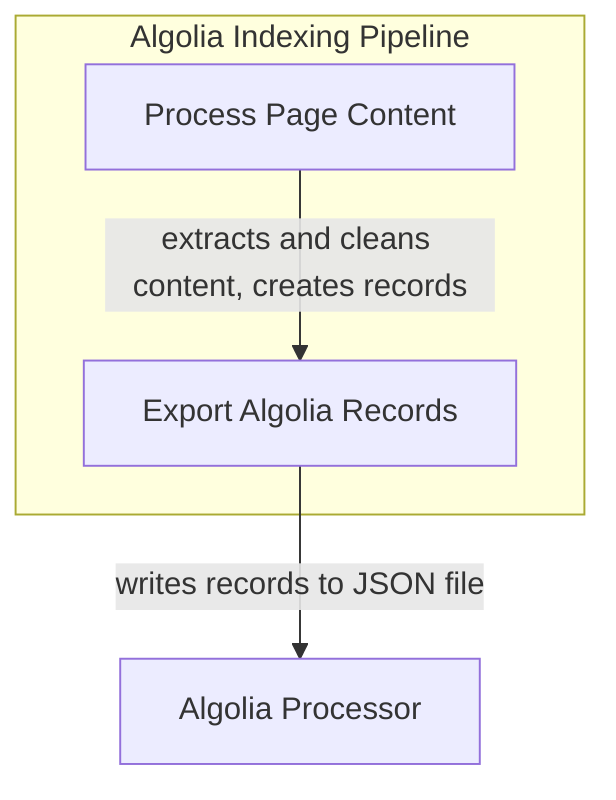

# Algolia Indexing Module

The `algolia_indexing` module is a crucial part of the documentation site's search functionality. It is responsible for processing the content of the generated HTML pages and transforming it into a structured format suitable for indexing by Algolia, a powerful hosted search engine. This ensures that users can effectively search and find relevant information within the documentation.

## Purpose

This module integrates directly into the MkDocs build process, acting as a hook to intercept and manipulate page content and manage the final output. Its primary goal is to:
*   Extract meaningful text and metadata from HTML pages.
*   Clean up extraneous UI elements and code formatting to produce clean search content.
*   Structure the extracted information into individual search records, including titles, content, and URLs.
*   Export these records to a JSON file that can be uploaded to Algolia for indexing.

## Architecture Overview

The `algolia_indexing` module operates through two main hooks provided by the MkDocs build system: `on_page_content` and `on_post_build`.

1.  **Content Processing (`on_page_content`):** This hook is triggered for each HTML page after it has been rendered. It takes the raw HTML, parses it using BeautifulSoup, and performs several cleaning operations. It identifies headings and sections, extracting plain text content and constructing `AlgoliaRecord` objects. These records contain the processed content, page title, section title, and a unique URL. The module prioritizes content from higher-level headings by assigning a rank.

2.  **Record Export (`on_post_build`):** Once all pages have been processed and the site build is complete, this hook gathers all the `AlgoliaRecord` objects that were collected. It then serializes these records into a JSON file, which is saved in the site's output directory. This JSON file is the final artifact used for populating the Algolia search index.

These two phases work in conjunction to ensure that all relevant documentation content is accurately captured and prepared for efficient search.

<!-- DIAGRAM_JSON
{
    "direction": "TD",
    "nodes": [
        {"id": "algolia_processor", "label": "Algolia Content Processor", "type": "module", "link": "algolia_processor.md"}
    ],
    "edges": [],
    "groups": [
        {
            "id": "indexing_process",
            "label": "Indexing Process",
            "role": "data",
            "nodes": ["algolia_processor"]
        }
    ]
}
-->

## Sub-modules

*   ### [Algolia Content Processor](algolia_processor.md)
    Handles content parsing and record generation for Algolia indexing, and outputs the final records.
