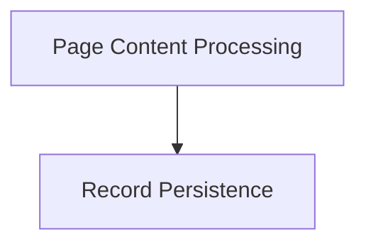

# Algolia Integration Module

## Introduction

The `algolia_integration` module is responsible for preparing and indexing the documentation content for Algolia search. It integrates with the documentation build process to extract relevant information from generated HTML pages and store it in a format suitable for Algolia.

## Architecture Overview

The module operates in two main phases:
1.  **Page Content Processing**: During the documentation build, it processes each page's HTML content to clean up presentational elements, standardize code blocks, and extract textual content and metadata for search indexing.
2.  **Record Persistence**: After the entire documentation site is built, it collects all the processed records and writes them to a designated JSON file, which is then used to upload the data to Algolia.

These two phases are handled by distinct sub-modules that work together to create a comprehensive search index.

<!-- DIAGRAM_JSON
{
    "direction": "TD",
    "nodes": [
        {"id": "page_content_processing", "label": "Page Content Processing", "type": "module", "link": "page_content_processing.md"},
        {"id": "record_persistence", "label": "Record Persistence", "type": "module", "link": "record_persistence.md"}
    ],
    "edges": [
        {"source": "page_content_processing", "target": "record_persistence"}
    ],
    "groups": []
}
-->

## High-Level Functionality

-   ### [Page Content Processing](page_content_processing.md)
    This sub-module (`page_content_processing`) processes the HTML content of each documentation page. It cleans up the HTML by removing unnecessary elements, normalizes code examples, and extracts structured data (title, sections, content) to create individual Algolia search records. It assigns a rank to sections to influence search result ordering.

-   ### [Record Persistence](record_persistence.md)
    The `record_persistence` sub-module is responsible for saving all the Algolia records generated during the build process. Once all pages have been processed, this module collects the accumulated records and writes them to a JSON file (`algolia_records.json`) in the site's output directory, making them ready for upload to the Algolia search service.
