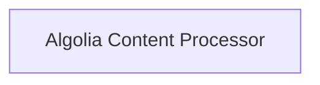

<!-- AUTO_GENERATED_PLACEHOLDER
  reason: LLM did not create .md file for this module
  module_path: project_documentation_and_developer_tools/search_and_indexing/algolia_indexing/algolia_processor
  component_count: 2
  generated_at: 2026-04-06T06:47:34.949619
  TODO: Fix LLM prompt to handle small leaf modules
-->

# Algolia Content Processor

> ⚠️ **Auto-Generated Placeholder**
> This documentation was auto-generated because the LLM failed to create it.
> Module path: `project_documentation_and_developer_tools/search_and_indexing/algolia_indexing/algolia_processor`

Handles content parsing and record generation for Algolia indexing, and outputs the final records.

## Components

This module contains 2 component(s):

- `docs..hooks.algolia.on_page_content`
- `docs..hooks.algolia.on_post_build`

## Structure

---
*Auto-generated placeholder. See sync_issues.json for details.*
