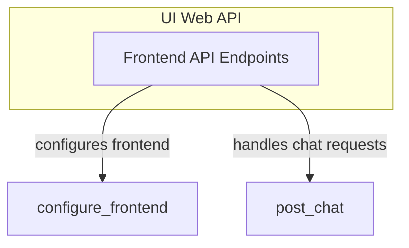

# API Handlers Module

## Introduction

The `api_handlers` module is a crucial part of the UI web API, specifically designed to manage frontend configuration and process chat interactions. It serves as the primary interface between the web client and the underlying AI agent, enabling dynamic UI setup and real-time chat functionalities.

## Architecture Overview

This module integrates directly with the UI's web API, providing endpoints that allow the frontend to retrieve necessary configuration details (like available models and tools) and submit chat requests for processing by the AI agent. It leverages the Vercel AI Adapter for efficient and standardized handling of chat requests, ensuring seamless communication and response streaming.

<!-- DIAGRAM_JSON
{
    "direction": "TD",
    "nodes": [
        {"id": "frontend_api", "label": "Frontend API Endpoints", "type": "module", "link": "frontend_api.md"}
    ],
    "edges": [],
    "groups": [
        {
            "id": "ui_api",
            "label": "UI Web API",
            "role": "surface",
            "nodes": ["frontend_api"]
        }
    ]
}
-->

## Sub-modules

* [Frontend API Endpoints](frontend_api.md): Provides API endpoints for configuring the UI and handling chat requests.
