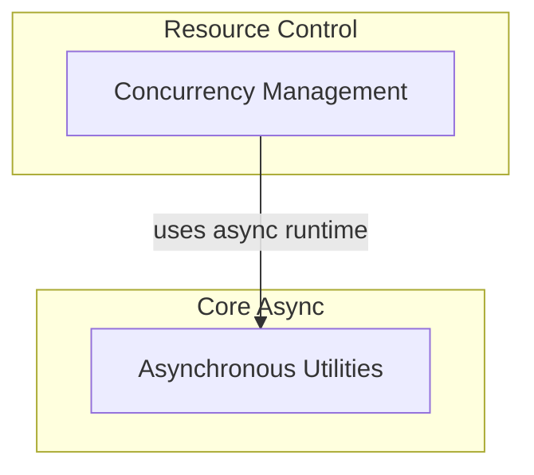

# Async Concurrency Module

The `async_concurrency` module is a vital component for managing asynchronous operations and controlling resource utilization within the system. It provides mechanisms to execute synchronous functions in a non-blocking manner and enforce concurrency limits across various parts of the application, ensuring stability and efficient resource allocation.

## Architecture Overview

The `async_concurrency` module is structured into two primary sub-modules: `asynchronous_utilities` and `concurrency_management`. These modules work together to provide a robust asynchronous execution environment and controlled access to shared resources.

<!-- DIAGRAM_JSON
{
    "direction": "TD",
    "nodes": [
        {
            "id": "async_concurrency",
            "label": "Asynchronous Concurrency",
            "type": "module"
        },
        {
            "id": "asynchronous_utilities",
            "label": "Asynchronous Utilities",
            "type": "module",
            "link": "asynchronous_utilities.md"
        },
        {
            "id": "concurrency_management",
            "label": "Concurrency Management",
            "type": "module",
            "link": "concurrency_management.md"
        }
    ],
    "edges": [
        {
            "source": "concurrency_management",
            "target": "asynchronous_utilities",
            "label": "uses async runtime"
        }
    ],
    "groups": [
        {
            "id": "core_async",
            "label": "Core Async",
            "role": "generative",
            "nodes": [
                "asynchronous_utilities"
            ]
        },
        {
            "id": "resource_control",
            "label": "Resource Control",
            "role": "analytical",
            "nodes": [
                "concurrency_management"
            ]
        }
    ]
}
-->

## Sub-modules

This module consists of the following sub-modules:

### [Asynchronous Utilities](asynchronous_utilities.md)
This sub-module provides helper functions for managing asynchronous execution, including running synchronous code in a thread pool and retrieving the active event loop. It's foundational for enabling non-blocking I/O and concurrent task execution throughout the system.

### [Concurrency Management](concurrency_management.md)
This sub-module implements a robust concurrency limiter with observability features, allowing control over the number of simultaneously running and queued operations. It is crucial for preventing resource exhaustion and ensuring system stability under heavy load by regulating access to critical sections or external services.
