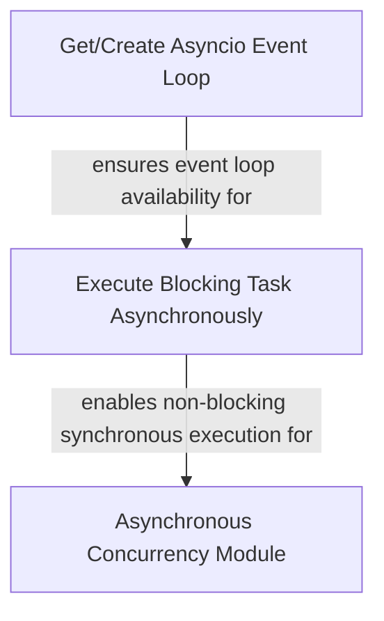

# `async_execution_primitives` Module Documentation

The `async_execution_primitives` module provides fundamental utilities for managing asynchronous operations within the `pydantic_ai_agent_core` system. Its core purpose is to ensure that synchronous, potentially blocking, functions can be executed without halting the main asynchronous event loop, and to provide a robust way to obtain or initialize the asyncio event loop. This is critical for maintaining responsiveness and efficiency in an agent-based system that frequently interacts with external tools, APIs, or performs CPU-bound computations.

From a user's perspective, this module allows higher-level components, such as those responsible for agent capabilities or tool execution, to seamlessly integrate synchronous code into an asynchronous workflow. It abstractly handles the complexities of thread pool management and event loop instantiation, enabling developers to focus on the business logic rather than low-level concurrency concerns.

This module is a foundational part of the `async_concurrency` submodule within `agent_utilities`, serving as the bedrock upon which more complex asynchronous behaviors and concurrency management strategies are built.

<!-- DIAGRAM_JSON
{
    "direction": "TD",
    "nodes": [
        {"id": "get_event_loop", "label": "Get/Create Asyncio Event Loop", "type": "component", "link": null},
        {"id": "run_in_executor", "label": "Execute Blocking Task Asynchronously", "type": "component", "link": null},
        {"id": "async_concurrency_mod", "label": "Asynchronous Concurrency Module", "type": "external", "link": "async_concurrency.md"}
    ],
    "edges": [
        {"source": "get_event_loop", "target": "run_in_executor", "label": "ensures event loop availability for"},
        {"source": "run_in_executor", "target": "async_concurrency_mod", "label": "enables non-blocking synchronous execution for"}
    ],
    "groups": []
}
-->

### Core Components

#### `get_event_loop`

This utility function ensures that an `asyncio` event loop is available and running for the current thread. If a loop is already running, it returns it. If no loop is found, it creates a new one and sets it as the current event loop for the thread. This component is crucial for any part of the system that needs to perform asynchronous operations, acting as the entry point for `asyncio`'s concurrency model.

#### `run_in_executor`

The `run_in_executor` asynchronous function is designed to execute a synchronous callable within a separate thread pool executor, thereby preventing it from blocking the main `asyncio` event loop. This is particularly useful for integrating CPU-bound or blocking I/O operations (e.g., file system access, network requests that don't have async equivalents) into an asynchronous application without sacrificing responsiveness. It leverages `asyncio.run_in_executor` and integrates with a global thread executor managed by the system, ensuring efficient resource utilization. It also supports `contextvars` propagation, meaning the execution context from the calling async function is maintained in the thread where the synchronous function runs.

### How it Connects to the System

The `async_execution_primitives` module forms the bedrock of asynchronous execution for the entire `pydantic_ai_agent_core`. It provides the low-level mechanisms that:

*   **Support `async_concurrency`**: The parent module, `async_concurrency`, likely orchestrates higher-level concurrency patterns and may use `run_in_executor` to manage a pool of threads for synchronous tasks, ensuring that agents can perform diverse operations (e.g., tool calls, data processing) without blocking the main event loop.
*   **Enable Responsive Agent Behavior**: By allowing synchronous code to run without blocking, agents can remain responsive while performing tasks that would otherwise halt execution. This includes interactions with external tools or models that might not expose an asynchronous interface.
*   **Simplify Async Development**: Developers using the `pydantic_ai_agent_core` do not need to manually manage `asyncio` event loops or thread pools for basic blocking operations; they can rely on these primitives to handle the underlying complexities.

For further details on how these primitives are integrated into a broader concurrency strategy, refer to the [async_concurrency.md](async_concurrency.md) documentation.
