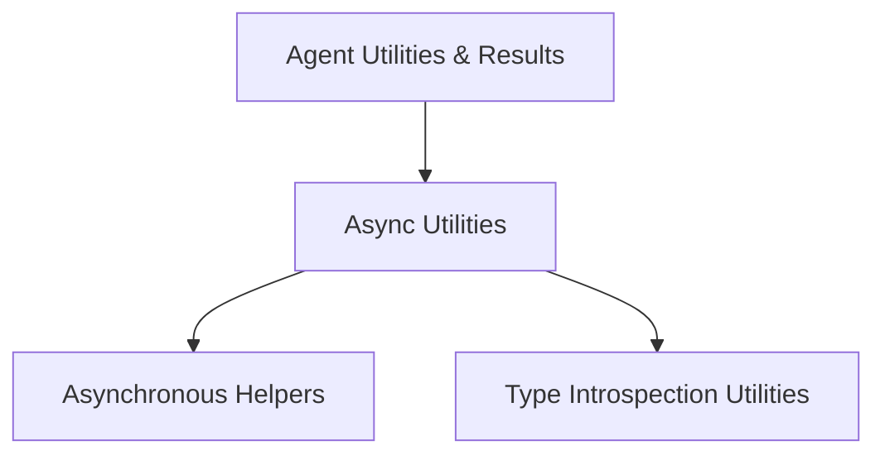

# Async Utilities Module

The `async_utilities` module provides a collection of essential helper functions primarily focused on asynchronous execution management and advanced type introspection within the `pydantic_ai_agent_core` system. It ensures efficient handling of concurrent operations and provides tools for dynamic type analysis.

## Architecture Overview

This module is a part of the `agent_utilities_results` module and serves as a foundational layer for asynchronous operations and type analysis. It is composed of two main sub-modules: `async_helpers` for managing asynchronous execution and event loops, and `type_introspection` for inspecting and processing Python type hints.

<!-- DIAGRAM_JSON
{
    "direction": "TD",
    "nodes": [
        {"id": "agent_utilities_results", "label": "Agent Utilities & Results", "type": "external", "link": "agent_utilities_results.md"},
        {"id": "async_utilities", "label": "Async Utilities", "type": "module", "link": "async_utilities.md"},
        {"id": "async_helpers", "label": "Asynchronous Helpers", "type": "module", "link": "async_helpers.md"},
        {"id": "type_introspection", "label": "Type Introspection Utilities", "type": "module", "link": "type_introspection.md"}
    ],
    "edges": [
        {"source": "agent_utilities_results", "target": "async_utilities"},
        {"source": "async_utilities", "target": "async_helpers"},
        {"source": "async_utilities", "target": "type_introspection"}
    ],
    "groups": []
}
-->

## Sub-modules

### [Asynchronous Helpers](async_helpers.md)
This sub-module provides utilities for running synchronous functions in an asynchronous context and managing the asyncio event loop. Key functionalities include `run_in_executor` for offloading blocking calls to a thread pool and `get_event_loop` for retrieving or creating an asyncio event loop.

### [Type Introspection Utilities](type_introspection.md)
This sub-module offers helper functions for inspecting and extracting arguments from Python type hints, specifically designed for handling Union types. Its primary function, `get_union_args`, facilitates deeper introspection into complex type structures.
