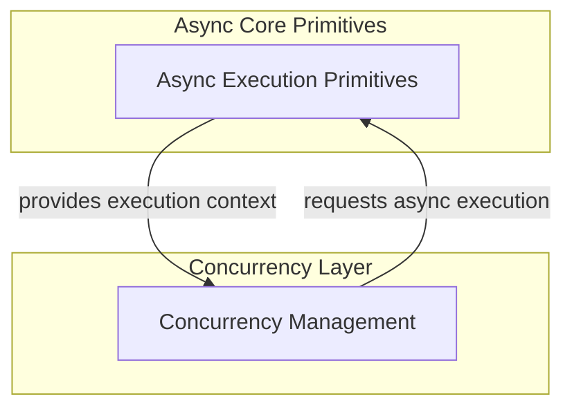

# Asynchronous Utilities

The `asynchronous_utilities` module provides core primitives for managing asynchronous operations within the system. It offers mechanisms to execute synchronous functions in a non-blocking manner and to reliably obtain the asyncio event loop. This module is critical for ensuring smooth concurrency and responsiveness across various asynchronous components.

## Architecture Overview

This module is a foundational layer for asynchronous execution, primarily focusing on abstracting away the complexities of thread pool execution and event loop management. It ensures that long-running synchronous tasks do not block the main event loop, and provides a consistent way to access the asyncio event loop for various asynchronous operations. It integrates with the broader `async_concurrency` module by providing the underlying asynchronous mechanisms that `concurrency_management` might leverage.

<!-- DIAGRAM_JSON
{
    "direction": "TD",
    "nodes": [
        {
            "id": "asynchronous_utilities",
            "label": "Asynchronous Utilities",
            "type": "module"
        },
        {
            "id": "c0",
            "label": "get_event_loop",
            "type": "component"
        }
    ],
    "edges": [
        {
            "source": "asynchronous_utilities",
            "target": "c0"
        }
    ],
    "groups": [],
    "_auto_generated": true
}
-->

## Sub-modules

*   [Async Execution Primitives](async_execution_primitives.md): Provides fundamental utilities for managing asynchronous operations, including executing synchronous functions in a thread pool and retrieving the current event loop.