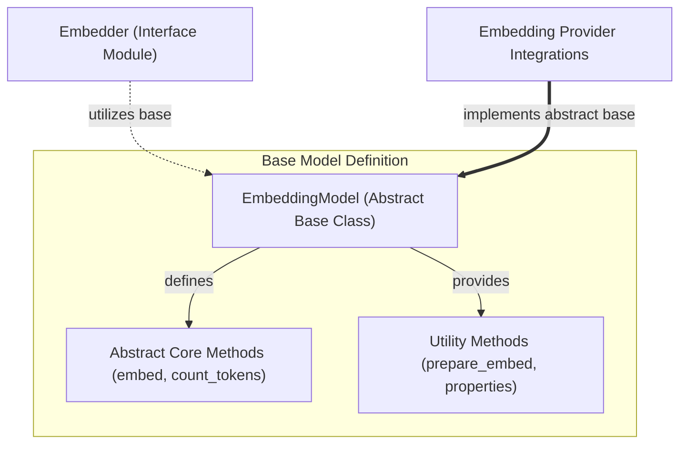

# Base Embedding Model (base_embedding_model)

The `base_embedding_model` module defines the foundational abstract interface for all embedding models within the system. It provides a standardized contract for generating embeddings from various types of inputs, managing model-specific settings, and reporting model metadata. This module is crucial for ensuring interoperability and extensibility across different embedding service providers.

## Core Components

The primary component of this module is the `EmbeddingModel` abstract base class.

### `EmbeddingModel`

The `EmbeddingModel` class is an abstract base class that all concrete embedding model implementations must extend. It defines the essential methods and properties required for any embedding model to function within the `pydantic_ai` framework.

**Key Responsibilities:**

*   **Standardized Interface:** Ensures a consistent API for embedding operations, regardless of the underlying provider (e.g., OpenAI, Cohere, Google, Bedrock).
*   **Settings Management:** Allows for model-specific settings to be configured, providing flexibility and customization.
*   **Abstract Operations:** Declares abstract methods such as `embed` for generating embeddings and `count_tokens` for tokenization, which must be implemented by subclasses.
*   **Input Preparation Utility:** Provides a `prepare_embed` method to standardize input data and merge settings before the actual embedding process.

**Why it matters:**

This abstract base class is fundamental for the entire embedding subsystem. It enforces a common structure, which simplifies the integration of new embedding providers and ensures that other parts of the system (like the [Embedding Interface](embedding_interface.md)) can interact with any embedding model uniformly. It promotes code reusability and maintainability by centralizing the core requirements for embedding models.

## How it works

The `EmbeddingModel` serves as a blueprint. Concrete implementations (found in the [Embedding Provider Integrations](embedding_provider_integrations.md) module) inherit from `EmbeddingModel` and provide the specific logic for interacting with external embedding APIs or local models.

When an embedding operation is requested, the system typically interacts with an `Embedder` instance (from the [Embedding Interface](embedding_interface.md) module), which then delegates the actual embedding task to a concrete `EmbeddingModel` implementation. The `EmbeddingModel` handles the details of converting inputs into embeddings according to its provider's specifications.

<!-- DIAGRAM_JSON
{
    "direction": "TD",
    "nodes": [
        {"id": "embedding_model_base", "label": "EmbeddingModel (Abstract Base Class)", "type": "component", "link": null},
        {"id": "abstract_methods", "label": "Abstract Core Methods (embed, count_tokens)", "type": "component", "link": null},
        {"id": "utility_methods", "label": "Utility Methods (prepare_embed, properties)", "type": "component", "link": null},
        {"id": "embedding_interface_mod", "label": "Embedder (Interface Module)", "type": "external", "link": "embedding_interface.md"},
        {"id": "embedding_provider_mod", "label": "Embedding Provider Integrations", "type": "external", "link": "embedding_provider_integrations.md"}
    ],
    "edges": [
        {"source": "embedding_model_base", "target": "abstract_methods", "label": "defines"},
        {"source": "embedding_model_base", "target": "utility_methods", "label": "provides"},
        {"source": "embedding_interface_mod", "target": "embedding_model_base", "label": "utilizes base", "type": "dashed"},
        {"source": "embedding_provider_mod", "target": "embedding_model_base", "label": "implements abstract base", "type": "heavy"}
    ],
    "groups": [
        {
            "id": "base_model_definition",
            "label": "Base Model Definition",
            "role": "core",
            "nodes": ["embedding_model_base", "abstract_methods", "utility_methods"]
        }
    ]
}
-->

## How it connects to the rest of the system

The `base_embedding_model` module is a foundational layer for all embedding functionalities.

*   **[Embedding Interface](embedding_interface.md):** The `Embedder` class in the `embedding_interface` module acts as the entry point for clients wishing to use embedding models. It relies on the `EmbeddingModel` interface to dispatch embedding requests to concrete implementations.
*   **[Embedding Provider Integrations](embedding_provider_integrations.md):** This module contains all the specific implementations (e.g., `OpenAIEmbeddingModel`, `CohereEmbeddingModel`) that inherit from `EmbeddingModel` and provide the actual logic for interacting with various embedding service providers.
*   **Higher-Level Features:** Any feature or agent within the system that requires text embeddings (e.g., for RAG, semantic search, or similarity computations) will ultimately rely on an `EmbeddingModel` instance, either directly or indirectly through the `Embedder` interface.

By providing a clear and extensible abstract interface, `base_embedding_model` ensures that the system can easily support a wide range of current and future embedding technologies without requiring significant changes to the core application logic.
