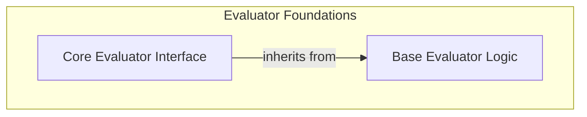

# Base Evaluator Interfaces

The `base_evaluator_interfaces` module provides the foundational abstract classes and interfaces for creating custom evaluators within the pydantic-evals framework. It establishes the core contract that all evaluators must adhere to, defining how they are serialized, how they build their specifications, and how they perform their evaluation logic.

This module is critical for ensuring consistency and interoperability across different evaluation components, allowing for flexible and extensible evaluation scenarios.

## Architecture Overview

The `base_evaluator_interfaces` module is composed of two primary sub-modules:

- **Base Evaluator Logic ([base_evaluator.md](base_evaluator.md))**: Defines the fundamental properties and serialization mechanisms shared by all evaluators.
- **Core Evaluator Interface ([evaluator_interface.md](evaluator_interface.md))**: Specifies the abstract methods for performing evaluations, catering to both synchronous and asynchronous implementations.

These sub-modules work together to provide a robust and flexible framework for defining and executing evaluations.

<!-- DIAGRAM_JSON
{
    "direction": "TD",
    "nodes": [
        {"id": "base_evaluator", "label": "Base Evaluator Logic", "type": "module", "link": "base_evaluator.md"},
        {"id": "evaluator_interface", "label": "Core Evaluator Interface", "type": "module", "link": "evaluator_interface.md"}
    ],
    "edges": [
        {"source": "evaluator_interface", "target": "base_evaluator", "label": "inherits from"}
    ],
    "groups": [
        {
            "id": "evaluator_foundations",
            "label": "Evaluator Foundations",
            "role": "analytical",
            "nodes": ["base_evaluator", "evaluator_interface"]
        }
    ]
}
-->

