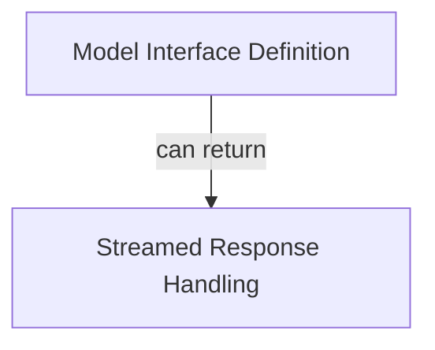

# Base Model Interfaces

The `base_model_interfaces` module defines the foundational abstract classes for interacting with various AI models within the `pydantic_ai_slim` framework. It establishes the core contracts for both synchronous and asynchronous model requests and streamed responses, ensuring a consistent interface across different model providers.

## Architecture Overview

This module primarily consists of two core interfaces that define how AI models are interacted with and how their streamed responses are handled. The `Model` interface provides the blueprint for AI model implementations, allowing for requests and token counting, while the `StreamedResponse` interface manages the lifecycle and processing of real-time model outputs.

The diagram below illustrates the relationship between these two core interfaces.

<!-- DIAGRAM_JSON
{
    "direction": "TD",
    "nodes": [
        {"id": "model_interface_definition", "label": "Model Interface Definition", "type": "module", "link": "model_interface_definition.md"},
        {"id": "streamed_response_handling", "label": "Streamed Response Handling", "type": "module", "link": "streamed_response_handling.md"}
    ],
    "edges": [
        {"source": "model_interface_definition", "target": "streamed_response_handling", "label": "can return"}
    ],
    "groups": []
}
-->

## Sub-modules

This module is composed of the following key sub-modules, each providing essential functionality for model interaction:

*   **[Model Interface Definition](model_interface_definition.md)**: This sub-module contains the `Model` abstract class, which serves as the base for all AI model implementations. It defines fundamental methods for making requests, counting tokens, and customizing request parameters before interaction with an AI provider.

*   **[Streamed Response Handling](streamed_response_handling.md)**: This sub-module encompasses the `StreamedResponse` abstract class, designed to manage asynchronous, streamed outputs from AI models. It handles event processing, part management, and the extraction of final results from a continuous stream of model responses.

