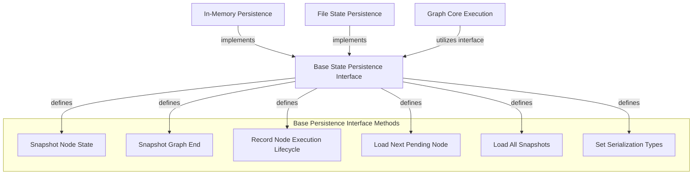

The `base_persistence_interface` module defines the foundational abstract interface for managing the state and execution history of graph-based processes. It provides a robust and flexible contract for how graph states, node executions, and completion events are recorded, retrieved, and managed, ensuring that different persistence mechanisms can be seamlessly integrated into the system. This module is critical for enabling features like fault tolerance, debugging, and historical analysis of graph runs.

### Core Functionality

The central component of this module is the `BaseStatePersistence` abstract base class. This class outlines a set of asynchronous methods that any concrete persistence implementation must provide to interact with the graph's state. Each instance of a `BaseStatePersistence` subclass is intended to manage a single graph run, ensuring isolation and clarity of state.

Key responsibilities defined by this interface include:

*   **Snapshotting Node States**: Recording the state of the graph before a node executes, capturing all relevant data for potential re-runs or analysis.
*   **Snapshotting Graph End States**: Storing the final state and output when a graph run concludes, whether successfully or with an error.
*   **Recording Node Execution Lifecycle**: Tracking the status (created, pending, running, success, error) and duration of individual node executions within the graph. This is achieved through an asynchronous context manager, ensuring proper start and end timestamps.
*   **Loading Next Nodes**: Efficiently retrieving the next eligible node for execution from persistent storage, facilitating continuation of interrupted runs or distributed execution.
*   **Loading Full History**: Providing a mechanism to retrieve all recorded snapshots for a given graph run, useful for debugging, visualization, or auditing.
*   **Type Management**: Allowing persistence layers to understand and apply Pydantic types for proper serialization and deserialization of graph states, ensuring data integrity across storage and retrieval.

### How it Fits into the System

The `base_persistence_interface` acts as the contract that decouples the graph execution logic from the specifics of how state is stored. Modules responsible for executing graphs, such as [graph_core_execution](graph_core_execution.md), interact solely with this abstract interface. This allows developers to swap out persistence implementations—such as in-memory, file-based, or database-backed solutions—without altering the core graph execution engine.

Concrete implementations, like [in_memory_state_persistence](in_memory_state_persistence.md) and [file_state_persistence](file_state_persistence.md), build upon this interface to provide actual storage mechanisms.

### Architecture Diagram

<!-- DIAGRAM_JSON
{
    "direction": "TD",
    "nodes": [
        {"id": "base_persistence_interface", "label": "Base State Persistence Interface", "type": "component", "link": null},
        {"id": "snapshot_node_method", "label": "Snapshot Node State", "type": "component", "link": null},
        {"id": "snapshot_end_method", "label": "Snapshot Graph End", "type": "component", "link": null},
        {"id": "record_run_method", "label": "Record Node Execution Lifecycle", "type": "component", "link": null},
        {"id": "load_next_method", "label": "Load Next Pending Node", "type": "component", "link": null},
        {"id": "load_all_method", "label": "Load All Snapshots", "type": "component", "link": null},
        {"id": "set_types_method", "label": "Set Serialization Types", "type": "component", "link": null},
        {"id": "in_memory_state_persistence", "label": "In-Memory Persistence", "type": "external", "link": "in_memory_state_persistence.md"},
        {"id": "file_state_persistence", "label": "File State Persistence", "type": "external", "link": "file_state_persistence.md"},
        {"id": "graph_core_execution", "label": "Graph Core Execution", "type": "external", "link": "graph_core_execution.md"}
    ],
    "edges": [
        {"source": "base_persistence_interface", "target": "snapshot_node_method", "label": "defines"},
        {"source": "base_persistence_interface", "target": "snapshot_end_method", "label": "defines"},
        {"source": "base_persistence_interface", "target": "record_run_method", "label": "defines"},
        {"source": "base_persistence_interface", "target": "load_next_method", "label": "defines"},
        {"source": "base_persistence_interface", "target": "load_all_method", "label": "defines"},
        {"source": "base_persistence_interface", "target": "set_types_method", "label": "defines"},
        {"source": "in_memory_state_persistence", "target": "base_persistence_interface", "label": "implements"},
        {"source": "file_state_persistence", "target": "base_persistence_interface", "label": "implements"},
        {"source": "graph_core_execution", "target": "base_persistence_interface", "label": "utilizes interface"}
    ],
    "groups": [
        {
            "id": "persistence_interface_details",
            "label": "Base Persistence Interface Methods",
            "role": "core",
            "nodes": ["snapshot_node_method", "snapshot_end_method", "record_run_method", "load_next_method", "load_all_method", "set_types_method"]
        }
    ]
}
-->
