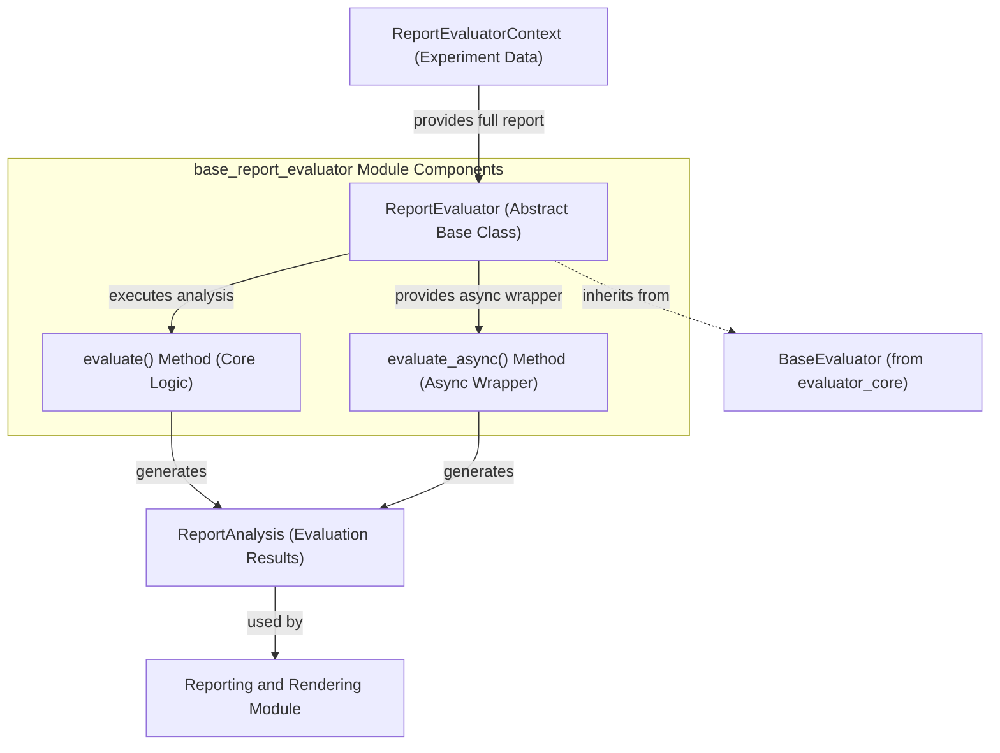

# base_report_evaluator Module Documentation

## Introduction

The `base_report_evaluator` module is a foundational component within the evaluation framework, providing the `ReportEvaluator` abstract base class. This module is dedicated to defining the interface for evaluators that perform analyses across an entire experiment's results, rather than focusing on individual test cases. It is crucial for generating comprehensive, experiment-wide insights such as statistical summaries, performance metrics, and detailed breakdowns of overall system behavior.

## Core Functionality

The `ReportEvaluator` class serves as the blueprint for creating specialized evaluators that need to process and interpret a complete set of experiment outcomes. Its primary function is to enable the aggregation and analysis of data from multiple evaluation cases to produce a holistic view of system performance. This capability is essential for understanding general trends, identifying systemic issues, and calculating metrics that span the entire dataset, such as confusion matrices, precision-recall curves, or aggregated scalar statistics.

### Key Components

*   **`ReportEvaluator`**: This is the abstract base class (ABC) that defines the common interface for all report-level evaluators. It is a generic class, allowing it to be parameterized with specific types for inputs, outputs, and metadata relevant to the experiment being evaluated. Concrete implementations of this class will provide the actual logic for analyzing full reports.
*   **`evaluate(self, ctx: ReportEvaluatorContext) -> ReportAnalysis | list[ReportAnalysis]`**: An abstract method that must be implemented by any concrete `ReportEvaluator`. This method receives a `ReportEvaluatorContext` which contains all the necessary data from the experiment report. It is responsible for performing the core analysis and returning one or more `ReportAnalysis` objects that encapsulate the findings. This method can be implemented synchronously or asynchronously.
*   **`evaluate_async(self, ctx: ReportEvaluatorContext) -> ReportAnalysis | list[ReportAnalysis]`**: A convenience method that provides a unified asynchronous interface for evaluation. It handles the execution of the `evaluate` method, correctly awaiting its result if the implementation is asynchronous, thus simplifying the consumption of report evaluations.

### How it Works

1.  **Contextual Data Provision**: An instance of `ReportEvaluatorContext` is provided to the `ReportEvaluator`. This context object is designed to hold all relevant information from an experiment, including the results of individual test cases, their initial inputs, generated outputs, and any associated metadata.
2.  **Report-Wide Analysis Execution**: Implementations inheriting from `ReportEvaluator` override the abstract `evaluate` method. Within this method, they implement the specific logic required to analyze the aggregated data from the `ReportEvaluatorContext`. This can range from simple statistical calculations to complex data aggregations and transformations.
3.  **Structured Analysis Output**: The outcome of the analysis is encapsulated within one or more `ReportAnalysis` objects. These objects provide a standardized and structured way to represent the findings of the report-level evaluation, making them easy to consume by other parts of the system, particularly for reporting and visualization.

## Relationship to Other Modules

The `base_report_evaluator` module integrates closely with several other modules within the `pydantic_evals_framework` to provide a robust evaluation system:

*   **`evaluator_core`**: The `ReportEvaluator` inherits from `BaseEvaluator` (see [evaluator_core](evaluator_core.md)), establishing its fundamental role within the overall evaluation framework. The `ReportEvaluatorContext` also originates from or is defined in conjunction with the core evaluation types found in `evaluator_core.md`.
*   **`metric_evaluators`**: As a sub-module of `metric_evaluators`, `base_report_evaluator` forms the foundation for specialized evaluators that focus on generating various metrics from entire reports. Other modules, such as [statistical_report_evaluators](statistical_report_evaluators.md), build upon this base class to provide specific statistical analyses.
*   **`reporting_and_rendering`**: The `ReportAnalysis` objects generated by `ReportEvaluator` implementations are typically consumed by components within the [reporting_and_rendering](reporting_and_rendering.md) module. This module is responsible for presenting, visualizing, storing, or further processing the detailed analysis results.

<!-- DIAGRAM_JSON
{
    "direction": "TD",
    "nodes": [
        {"id": "report_evaluator", "label": "ReportEvaluator (Abstract Base Class)", "type": "component", "link": null},
        {"id": "evaluate_method", "label": "evaluate() Method (Core Logic)", "type": "component", "link": null},
        {"id": "evaluate_async_method", "label": "evaluate_async() Method (Async Wrapper)", "type": "component", "link": null},
        {"id": "evaluator_context", "label": "ReportEvaluatorContext (Experiment Data)", "type": "external", "link": "evaluator_core.md"},
        {"id": "report_analysis_output", "label": "ReportAnalysis (Evaluation Results)", "type": "external", "link": "reporting_and_rendering.md"},
        {"id": "base_evaluator_base", "label": "BaseEvaluator (from evaluator_core)", "type": "external", "link": "evaluator_core.md"},
        {"id": "reporting_and_rendering", "label": "Reporting and Rendering Module", "type": "external", "link": "reporting_and_rendering.md"}
    ],
    "edges": [
        {"source": "evaluator_context", "target": "report_evaluator", "label": "provides full report"},
        {"source": "report_evaluator", "target": "evaluate_method", "label": "executes analysis"},
        {"source": "report_evaluator", "target": "evaluate_async_method", "label": "provides async wrapper"},
        {"source": "evaluate_method", "target": "report_analysis_output", "label": "generates"},
        {"source": "evaluate_async_method", "target": "report_analysis_output", "label": "generates"},
        {"source": "report_evaluator", "target": "base_evaluator_base", "label": "inherits from", "line_type": "dashed"},
        {"source": "report_analysis_output", "target": "reporting_and_rendering", "label": "used by"}
    ],
    "groups": [
        {
            "id": "base_report_evaluator_components",
            "label": "base_report_evaluator Module Components",
            "role": "main_logic",
            "nodes": ["report_evaluator", "evaluate_method", "evaluate_async_method"]
        }
    ]
}
-->

