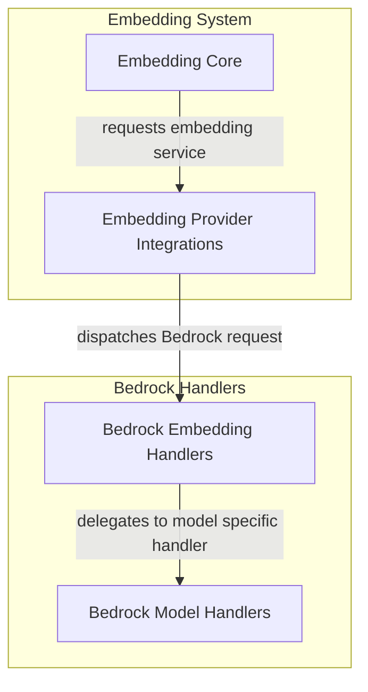

# Bedrock Embedding Handlers

The `bedrock_embedding_handlers` module provides specialized handlers for interacting with various embedding models hosted on Amazon Bedrock. This module is critical for enabling `pydantic_ai_slim` to generate embeddings using AWS Bedrock services, ensuring compatibility and optimized performance for different Bedrock-supported models like Cohere, Nova, and Titan.

## Architecture Overview

This module acts as a concrete implementation layer within the broader embedding system. It receives requests from the `embedding_provider_integrations` module, which is responsible for abstracting different embedding service providers. Upon receiving a request for a Bedrock model, `bedrock_embedding_handlers` dispatches the request to the appropriate model-specific handler contained within the `bedrock_embedding_model_handlers` sub-module. These handlers then manage the model-specific request preparation, execution, and response parsing, integrating seamlessly with the `embedding_core` for consistent embedding generation.

<!-- DIAGRAM_JSON
{
    "direction": "TD",
    "nodes": [
        {"id": "embedding_core", "label": "Embedding Core", "type": "external", "link": "embedding_core.md"},
        {"id": "embedding_provider_integrations", "label": "Embedding Provider Integrations", "type": "external", "link": "embedding_provider_integrations.md"},
        {"id": "bedrock_embedding_handlers", "label": "Bedrock Embedding Handlers", "type": "module", "link": "bedrock_embedding_handlers.md"},
        {"id": "bedrock_embedding_model_handlers", "label": "Bedrock Model Handlers", "type": "module", "link": "bedrock_embedding_model_handlers.md"}
    ],
    "edges": [
        {"source": "embedding_core", "target": "embedding_provider_integrations", "label": "requests embedding service"},
        {"source": "embedding_provider_integrations", "target": "bedrock_embedding_handlers", "label": "dispatches Bedrock request"},
        {"source": "bedrock_embedding_handlers", "target": "bedrock_embedding_model_handlers", "label": "delegates to model specific handler"}
    ],
    "groups": [
        {
            "id": "embedding_system",
            "label": "Embedding System",
            "role": "analytical",
            "nodes": ["embedding_core", "embedding_provider_integrations"]
        },
        {
            "id": "bedrock_handlers_group",
            "label": "Bedrock Handlers",
            "role": "generative",
            "nodes": ["bedrock_embedding_handlers", "bedrock_embedding_model_handlers"]
        }
    ]
}
-->

## Sub-modules

This module contains the following key sub-modules:

*   **[Bedrock Embedding Model Handlers](bedrock_embedding_model_handlers.md)**: Manages specific embedding model interactions for Amazon Bedrock, including Cohere, Nova, and Titan models. Each handler prepares requests and parses responses for its respective model.
