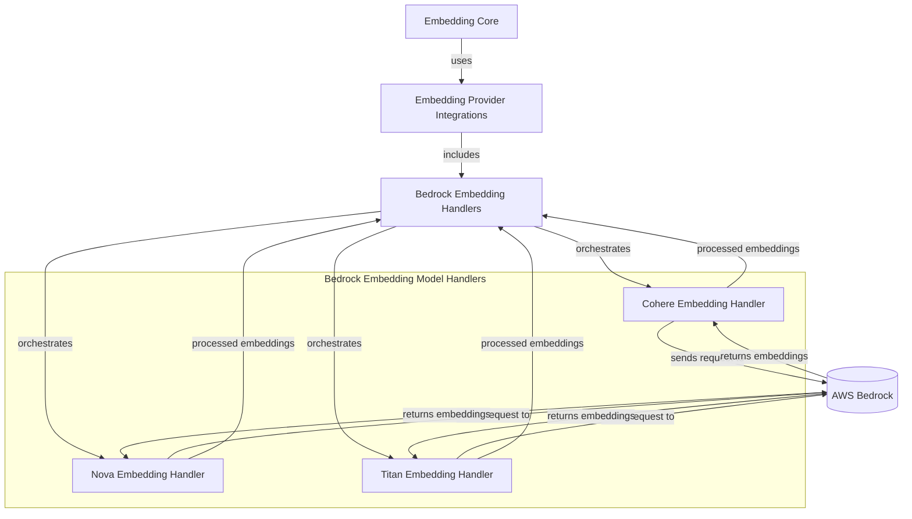

# Bedrock Embedding Model Handlers

The `bedrock_embedding_model_handlers` module provides specific implementations for interacting with various embedding models available through AWS Bedrock. This module acts as an intermediary, translating generic embedding requests into Bedrock-specific API calls and parsing the responses back into a consistent format. It is a critical component for integrating Bedrock's powerful embedding capabilities into the larger system.

## Architecture Overview

This module contains specialized handlers for different Bedrock embedding models. Each handler is responsible for the unique request preparation and response parsing required by its respective model, ensuring seamless integration with the broader [Embedding Core](embedding_core.md) and [Embedding Provider Integrations](embedding_provider_integrations.md). These handlers are orchestrated by the [Bedrock Embedding Handlers](bedrock_embedding_handlers.md) module.

<!-- DIAGRAM_JSON
{
    "direction": "TD",
    "nodes": [
        {
            "id": "bedrock_embedding_model_handlers",
            "label": "Bedrock Embedding Model Handlers",
            "type": "module"
        },
        {
            "id": "cohere_handler",
            "label": "Cohere Embedding Handler",
            "type": "module",
            "link": "cohere_embedding_handler.md"
        },
        {
            "id": "nova_handler",
            "label": "Nova Embedding Handler",
            "type": "module",
            "link": "nova_embedding_handler.md"
        },
        {
            "id": "titan_handler",
            "label": "Titan Embedding Handler",
            "type": "module",
            "link": "titan_embedding_handler.md"
        },
        {
            "id": "embedding_core_module",
            "label": "Embedding Core",
            "type": "external",
            "link": "embedding_core.md"
        },
        {
            "id": "embedding_provider_integrations_module",
            "label": "Embedding Provider Integrations",
            "type": "external",
            "link": "embedding_provider_integrations.md"
        },
        {
            "id": "bedrock_embedding_handlers_module",
            "label": "Bedrock Embedding Handlers",
            "type": "external",
            "link": "bedrock_embedding_handlers.md"
        },
        {
            "id": "bedrock_service",
            "label": "AWS Bedrock",
            "type": "external"
        },
        {
            "id": "cohere_embedding_handler",
            "label": "Cohere Embedding Handler",
            "type": "module",
            "link": "cohere_embedding_handler.md"
        },
        {
            "id": "nova_embedding_handler",
            "label": "Nova Embedding Handler",
            "type": "module",
            "link": "nova_embedding_handler.md"
        },
        {
            "id": "titan_embedding_handler",
            "label": "Titan Embedding Handler",
            "type": "module",
            "link": "titan_embedding_handler.md"
        }
    ],
    "edges": [
        {
            "source": "embedding_core_module",
            "target": "embedding_provider_integrations_module",
            "label": "uses"
        },
        {
            "source": "embedding_provider_integrations_module",
            "target": "bedrock_embedding_handlers_module",
            "label": "includes"
        },
        {
            "source": "bedrock_embedding_handlers_module",
            "target": "cohere_handler",
            "label": "orchestrates"
        },
        {
            "source": "bedrock_embedding_handlers_module",
            "target": "nova_handler",
            "label": "orchestrates"
        },
        {
            "source": "bedrock_embedding_handlers_module",
            "target": "titan_handler",
            "label": "orchestrates"
        },
        {
            "source": "cohere_handler",
            "target": "bedrock_service",
            "label": "sends request to"
        },
        {
            "source": "nova_handler",
            "target": "bedrock_service",
            "label": "sends request to"
        },
        {
            "source": "titan_handler",
            "target": "bedrock_service",
            "label": "sends request to"
        },
        {
            "source": "bedrock_service",
            "target": "cohere_handler",
            "label": "returns embeddings"
        },
        {
            "source": "bedrock_service",
            "target": "nova_handler",
            "label": "returns embeddings"
        },
        {
            "source": "bedrock_service",
            "target": "titan_handler",
            "label": "returns embeddings"
        },
        {
            "source": "cohere_handler",
            "target": "bedrock_embedding_handlers_module",
            "label": "processed embeddings"
        },
        {
            "source": "nova_handler",
            "target": "bedrock_embedding_handlers_module",
            "label": "processed embeddings"
        },
        {
            "source": "titan_handler",
            "target": "bedrock_embedding_handlers_module",
            "label": "processed embeddings"
        },
        {
            "source": "cohere_handler",
            "target": "cohere_embedding_handler"
        },
        {
            "source": "cohere_handler",
            "target": "nova_embedding_handler"
        },
        {
            "source": "cohere_handler",
            "target": "titan_embedding_handler"
        }
    ],
    "groups": [
        {
            "id": "bedrock_embedding_model_handlers__group",
            "label": "Bedrock Embedding Model Handlers",
            "role": "generative",
            "nodes": [
                "cohere_handler",
                "nova_handler",
                "titan_handler"
            ],
            "_repaired": "r4_group_renamed_avoid_node_collision"
        }
    ]
}
-->

## Sub-modules

This module is further divided into the following sub-modules, each focusing on a specific Bedrock embedding model:

*   **[Cohere Embedding Handler](cohere_embedding_handler.md)**: Manages requests and responses for Cohere embedding models on AWS Bedrock, including version-specific parameter handling.
*   **[Nova Embedding Handler](nova_embedding_handler.md)**: Handles single-text embedding requests for Amazon Nova models on AWS Bedrock, with specific truncation and embedding purpose configurations.
*   **[Titan Embedding Handler](titan_embedding_handler.md)**: Implements request preparation and response parsing for Amazon Titan embedding models on AWS Bedrock, supporting version-specific parameter adjustments.
