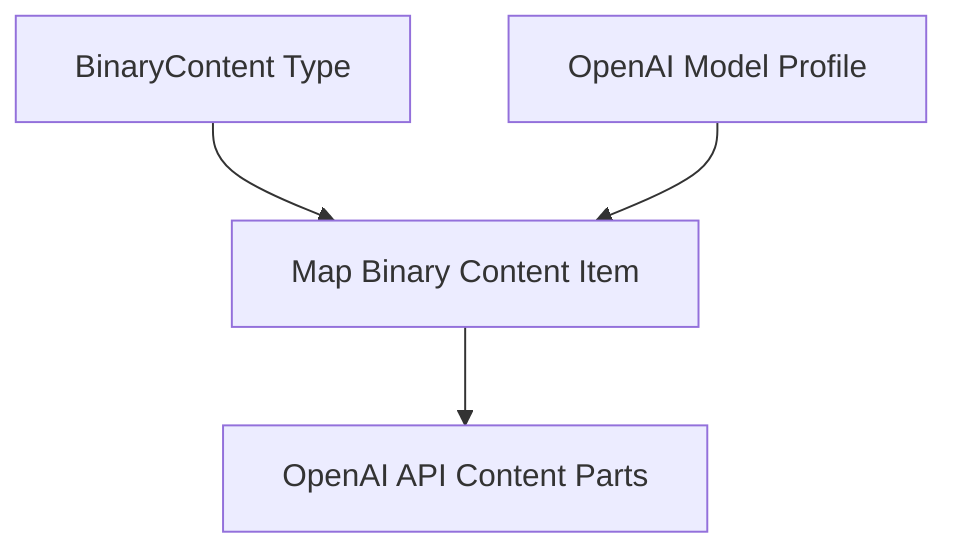

# binary_content_mapping

The `binary_content_mapping` module is a crucial component within the `pydantic_ai_models.openai_model_integration` ecosystem, specifically designed to facilitate the conversion of various binary content types into the format required by the OpenAI Chat Completions API. This module ensures that multimodal inputs, such as images, audio, and documents, can be seamlessly integrated into prompts for OpenAI models.

## Purpose and Core Functionality

The primary purpose of this module is to provide the `_map_binary_content_item` function, which acts as a versatile mapper for `BinaryContent` objects. It intelligently processes different media types and transforms them into the corresponding OpenAI API content part parameters.

### `_map_binary_content_item`

This asynchronous function takes a `BinaryContent` object and performs the following mapping logic:

*   **Text-like Content**: If the `media_type` is text-like (e.g., `text/plain`), the binary data is decoded to UTF-8 and inlined as a text block within the chat completion part.
*   **Images**: For image content, it constructs an `ImageURL` object. If vendor-specific metadata is available, it can include detail information (e.g., "auto", "low", "high") for image processing.
*   **Audio**: Supports `wav` and `mp3` audio formats. It can map audio content either as a data URI or as a base64 encoded string, depending on the `openai_chat_audio_input_encoding` specified in the [OpenAI Model Configuration](openai_model_configuration.md).
*   **Documents**: Maps document content to a `File` object, including its data URI and a placeholder filename.
*   **Video**: Currently, video URLs are explicitly not supported and will raise a `NotImplementedError`.
*   **Unsupported Types**: Any other unsupported binary content types will result in a `RuntimeError`.

## Architecture and Component Relationships

This module contains the core logic for translating abstract `BinaryContent` into OpenAI-specific structures. It interacts with configuration settings and outputs API-specific data types.

<!-- DIAGRAM_JSON
{
    "direction": "TD",
    "nodes": [
        {"id": "map_binary_content_item", "label": "Map Binary Content Item", "type": "component", "link": null},
        {"id": "binary_content_type", "label": "BinaryContent Type", "type": "external", "link": null},
        {"id": "openai_model_profile", "label": "OpenAI Model Profile", "type": "external", "link": "openai_model_configuration.md"},
        {"id": "openai_api_parts", "label": "OpenAI API Content Parts", "type": "external", "link": null}
    ],
    "edges": [
        {"source": "binary_content_type", "target": "map_binary_content_item"},
        {"source": "openai_model_profile", "target": "map_binary_content_item"},
        {"source": "map_binary_content_item", "target": "openai_api_parts"}
    ],
    "groups": []
}
-->

## How the Module Fits into the Overall System

The `binary_content_mapping` module is a leaf module within the `pydantic_ai_models` component hierarchy. It is specifically part of the [response_context_and_binary_mapping](response_context_and_binary_mapping.md) module, which in turn is part of the broader [openai_response_mapping](openai_response_mapping.md) and [openai_model_integration](openai_model_integration.md) within `pydantic_ai_core`.

Its function, `_map_binary_content_item`, is instrumental in preparing binary inputs for OpenAI's multimodal models. It serves as a critical bridge, allowing the higher-level `OpenAIModel` to correctly format and send diverse content types, ensuring the seamless functionality of AI agents that process or generate multimodal information. This clear separation of concerns allows for robust and maintainable handling of various data formats when interacting with OpenAI's API.