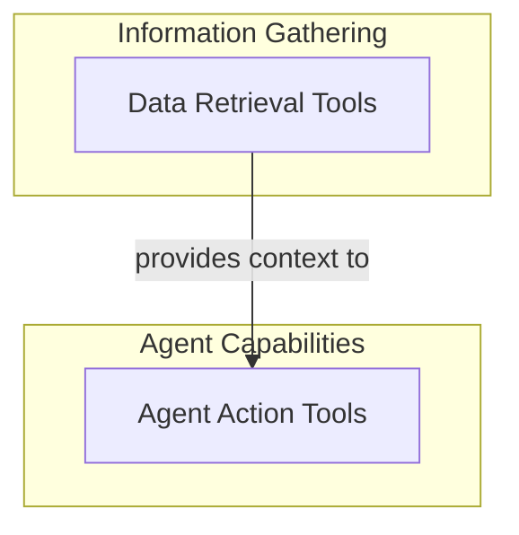

# Built-in Tools Module

The `builtin_tools` module provides a collection of essential, pre-integrated functionalities that significantly extend the capabilities of AI agents. These tools allow agents to interact with their environment, manage information, execute code, and maintain conversational context, enabling more sophisticated and versatile AI applications.

## Architecture Overview

The `builtin_tools` module is organized into two primary functional sub-modules: `data_retrieval_tools` and `agent_action_tools`. These sub-modules encapsulate different categories of tools, ensuring a clear separation of concerns and enhancing maintainability.

- **Data Retrieval Tools**: Focuses on enabling agents to fetch information from external sources (like URLs) and perform intelligent searches within uploaded files for Retrieval-Augmented Generation (RAG).
- **Agent Action Tools**: Provides agents with the ability to execute code and manage their internal memory for more dynamic and stateful interactions.

<!-- DIAGRAM_JSON
{
    "direction": "TD",
    "nodes": [
        {"id": "data_retrieval_tools", "label": "Data Retrieval Tools", "type": "module", "link": "data_retrieval_tools.md"},
        {"id": "agent_action_tools", "label": "Agent Action Tools", "type": "module", "link": "agent_action_tools.md"}
    ],
    "edges": [
        {"source": "data_retrieval_tools", "target": "agent_action_tools", "label": "provides context to"}
    ],
    "groups": [
        {
            "id": "information_gathering",
            "label": "Information Gathering",
            "role": "data",
            "nodes": ["data_retrieval_tools"]
        },
        {
            "id": "agent_capabilities",
            "label": "Agent Capabilities",
            "role": "generative",
            "nodes": ["agent_action_tools"]
        }
    ]
}
-->

### Sub-modules

This module contains the following sub-modules:

*   [Agent Action Tools](agent_action_tools.md): Tools for agents to execute code and manage memory.
*   [Data Retrieval Tools](data_retrieval_tools.md): Tools for fetching data from URLs and searching files.
