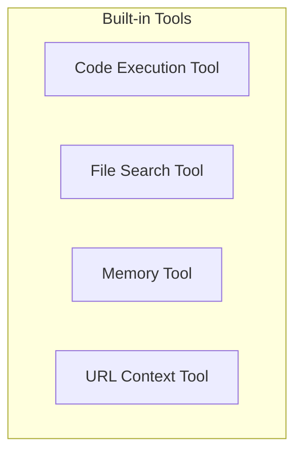

# Built-in Tools Module

## Introduction
The `builtin_tools` module provides a collection of essential tools that agents can utilize to interact with their environment, execute code, manage memory, and search through files. These tools are fundamental for extending the capabilities of AI agents, allowing them to perform complex tasks by integrating with external functionalities and data sources.

## Architecture
The `builtin_tools` module is composed of several specialized tools, each designed to handle a specific type of interaction or data processing. Each tool functions as a distinct component that agents can invoke based on their requirements.

<!-- DIAGRAM_JSON
{
    "direction": "TD",
    "nodes": [
        {"id": "code_execution_tool", "label": "Code Execution Tool", "type": "module", "link": "code_execution_tool.md"},
        {"id": "file_search_tool", "label": "File Search Tool", "type": "module", "link": "file_search_tool.md"},
        {"id": "memory_tool", "label": "Memory Tool", "type": "module", "link": "memory_tool.md"},
        {"id": "url_context_tool", "label": "URL Context Tool", "type": "module", "link": "url_context_tool.md"}
    ],
    "edges": [],
    "groups": []
}
-->

## Sub-modules and Functionality

### [Code Execution Tool](code_execution_tool.md)
This tool empowers agents to execute code, providing a powerful mechanism for dynamic problem-solving and interaction with computational environments. It is supported by several leading AI providers.

### [File Search Tool](file_search_tool.md)
The File Search Tool offers a fully managed Retrieval-Augmented Generation (RAG) system, enabling agents to search through uploaded files using vector search. It handles file storage, chunking, embedding generation, and context injection.

### [Memory Tool](memory_tool.md)
The Memory Tool provides agents with the capability to manage and utilize memory during their operations. This is crucial for maintaining context and improving performance in multi-turn interactions.

### [URL Context Tool](url_context_tool.md)
This tool is a deprecated alias for `WebFetchTool`. It is included for backward compatibility, allowing older serialized payloads to be deserialized correctly. Developers should use `WebFetchTool` for new implementations.