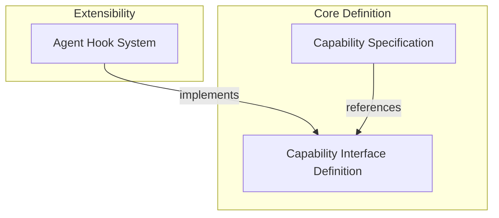

# Capabilities Base Module

The `capabilities_base` module forms the foundational layer for defining and integrating custom behaviors, settings, and lifecycle hooks within agents. It provides the core abstractions that enable agents to extend their functionality in a modular and declarative way, without directly modifying the agent's core logic. This module is crucial for developing robust and extensible AI agents by allowing developers to inject custom logic at various stages of an agent's operation, from initial setup to model interaction and tool execution.

## Architecture Overview

The `capabilities_base` module establishes the blueprint for all capabilities, which are reusable components that encapsulate specific functionalities for an agent. Capabilities influence an agent's behavior by:

*   Providing instructions for the system prompt.
*   Defining or modifying model settings.
*   Registering toolsets and built-in tools.
*   Offering a comprehensive set of lifecycle hooks to intercept and modify agent runs, node executions, model requests, and tool interactions.

This modular design ensures that capabilities can be easily added, removed, or combined, fostering a highly flexible agent architecture.

<!-- DIAGRAM_JSON
{
    "direction": "TD",
    "nodes": [
        {
            "id": "capabilities_base",
            "label": "Capabilities Base",
            "type": "module"
        },
        {
            "id": "capability_interface",
            "label": "Capability Interface Definition",
            "type": "module",
            "link": "capability_interface.md"
        },
        {
            "id": "capability_specification",
            "label": "Capability Specification",
            "type": "module",
            "link": "capability_specification.md"
        },
        {
            "id": "hook_system",
            "label": "Agent Hook System",
            "type": "module",
            "link": "hook_system.md"
        }
    ],
    "edges": [
        {
            "source": "hook_system",
            "target": "capability_interface",
            "label": "implements"
        },
        {
            "source": "capability_specification",
            "target": "capability_interface",
            "label": "references"
        }
    ],
    "groups": [
        {
            "id": "core_definition",
            "label": "Core Definition",
            "role": "analytical",
            "nodes": [
                "capability_interface",
                "capability_specification"
            ]
        },
        {
            "id": "extensibility",
            "label": "Extensibility",
            "role": "surface",
            "nodes": [
                "hook_system"
            ]
        }
    ]
}
-->

## Sub-modules

This module is composed of the following key sub-modules:

*   ### [Capability Interface Definition](capability_interface.md)
    This sub-module defines `AbstractCapability`, the abstract base class that all agent capabilities must inherit from. It outlines the contract for capabilities, specifying methods for providing instructions, model settings, toolsets, and a comprehensive set of lifecycle hooks for various stages of an agent's run.

*   ### [Capability Specification](capability_specification.md)
    This sub-module provides `CapabilitySpec`, a specialized specification class used for defining and serializing capabilities. It plays a role in schema generation, ensuring that capabilities can be represented and configured declaratively, especially when integrating with agent specifications.

*   ### [Agent Hook System](hook_system.md)
    The `hook_system` sub-module implements the `Hooks` capability, offering a flexible mechanism to register and dispatch hook functions. These hooks allow developers to intercept and modify different lifecycle events within an agent's execution, such as before/after model requests, tool validations, and tool executions, providing powerful extensibility without direct inheritance.
