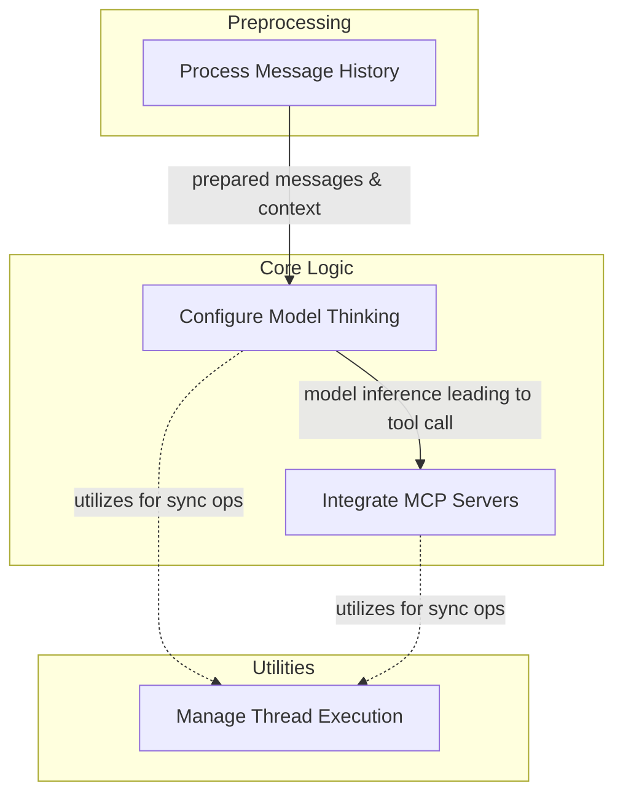

# Capabilities Core Logic Module

The `capabilities_core_logic` module provides essential capabilities that enhance the functionality and configurability of AI agents within the system. It encompasses core functionalities like processing message history, integrating with Multi-Capability Platform (MCP) servers, configuring agent thinking processes, and managing thread execution for synchronous operations. This module acts as a foundational layer, offering critical tools for agents to interact with their environment, process information, and execute tasks efficiently.

## Architecture Overview

This module is composed of several key sub-modules that work in concert to empower AI agents:

-   **[History Processing](history_processing.md)**: Responsible for pre-processing message history.
-   **[MCP Management](mcp_management.md)**: Handles integration with external Multi-Capability Platform (MCP) servers.
-   **[Agent Thinking Control](agent_thinking_control.md)**: Manages the configuration of the agent's reasoning and thinking processes.
-   **[Thread Execution Management](thread_execution_management.md)**: Provides controlled thread execution for synchronous tasks.

These components are designed to be modular and extensible, allowing agents to be customized with specific behaviors and integrations.

<!-- DIAGRAM_JSON
{
    "direction": "TD",
    "nodes": [
        {
            "id": "capabilities_core_logic",
            "label": "Capabilities Core Logic",
            "type": "module"
        },
        {
            "id": "history_processing",
            "label": "Process Message History",
            "type": "module",
            "link": "history_processing.md"
        },
        {
            "id": "agent_thinking_control",
            "label": "Configure Model Thinking",
            "type": "module",
            "link": "agent_thinking_control.md"
        },
        {
            "id": "mcp_management",
            "label": "Integrate MCP Servers",
            "type": "module",
            "link": "mcp_management.md"
        },
        {
            "id": "thread_execution_management",
            "label": "Manage Thread Execution",
            "type": "module",
            "link": "thread_execution_management.md"
        }
    ],
    "edges": [
        {
            "source": "history_processing",
            "target": "agent_thinking_control",
            "label": "prepared messages & context"
        },
        {
            "source": "agent_thinking_control",
            "target": "mcp_management",
            "label": "model inference leading to tool call"
        },
        {
            "source": "agent_thinking_control",
            "target": "thread_execution_management",
            "label": "utilizes for sync ops"
        },
        {
            "source": "mcp_management",
            "target": "thread_execution_management",
            "label": "utilizes for sync ops"
        }
    ],
    "groups": [
        {
            "id": "preprocessing",
            "label": "Preprocessing",
            "role": "generative",
            "nodes": [
                "history_processing"
            ]
        },
        {
            "id": "core_logic",
            "label": "Core Logic",
            "role": "generative",
            "nodes": [
                "agent_thinking_control",
                "mcp_management"
            ]
        },
        {
            "id": "utilities",
            "label": "Utilities",
            "role": "generative",
            "nodes": [
                "thread_execution_management"
            ]
        }
    ]
}
-->

