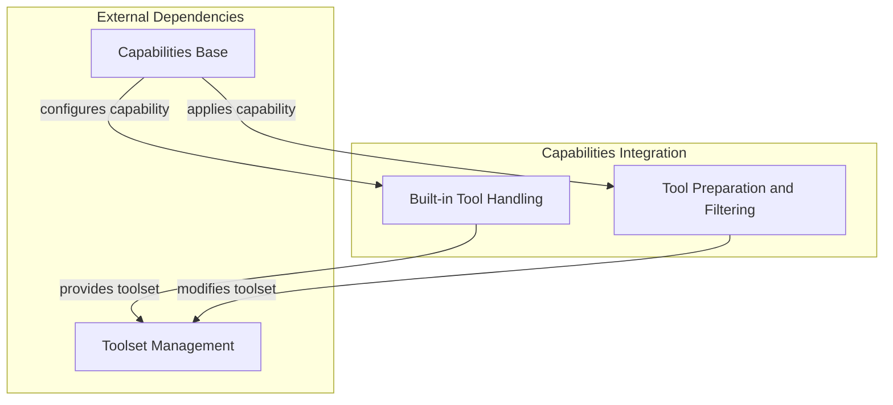

# Capabilities Tool Integration

The `capabilities_tool_integration` module is a core component within the Pydantic AI framework, designed to seamlessly integrate various tools and capabilities into an agent's operational workflow. It provides the foundational mechanisms for defining, preparing, and managing both provider-specific built-in tools and custom local tools, ensuring that agents have access to the necessary functionalities to achieve their goals.

## Purpose and Significance

This module plays a crucial role in empowering AI agents with the ability to interact with the external world and extend their native capabilities. By offering robust mechanisms for tool integration, `capabilities_tool_integration` allows developers to:
- Leverage powerful native tools offered by AI model providers.
- Implement custom functionalities as local tools, tailored to specific application needs.
- Dynamically modify and filter tool definitions, providing fine-grained control over which tools an agent can access and how they are presented.

It acts as a bridge, enabling agents to execute actions, retrieve information, and process data beyond their internal reasoning, making them more versatile and effective in complex environments.

## Architecture Overview

The `capabilities_tool_integration` module is composed of two primary sub-modules, each addressing a distinct aspect of tool management: `builtin_tool_handling` and `tool_preparation_and_filtering`. These sub-modules work in concert with the broader `capabilities_base` and `toolset_management` modules to create a flexible and powerful tool integration pipeline for AI agents.

The integration process typically involves:
1.  **Tool Definition**: Tools (both built-in and local) are defined and configured.
2.  **Preparation and Filtering**: Tools are dynamically modified, filtered, or enhanced based on specific requirements or contextual information.
3.  **Agent Execution**: The agent receives the prepared toolset and can invoke the appropriate tools during its operation.

## Sub-modules

### [Built-in Tool Handling](builtin_tool_handling.md)
This sub-module focuses on the intelligent integration of built-in tools provided by language model providers. It allows for the configuration of these tools, with the option to provide local fallbacks if a built-in tool is not supported or desired.

### [Tool Preparation and Filtering](tool_preparation_and_filtering.md)
This sub-module offers a powerful mechanism to dynamically manipulate tool definitions. It allows for filtering, modifying, or enhancing the tools available to an agent at runtime, providing granular control over the agent's capabilities.

<!-- DIAGRAM_JSON
{
    "direction": "TD",
    "nodes": [
        {"id": "builtin_tool_handling", "label": "Built-in Tool Handling", "type": "module", "link": "builtin_tool_handling.md"},
        {"id": "tool_preparation_and_filtering", "label": "Tool Preparation and Filtering", "type": "module", "link": "tool_preparation_and_filtering.md"},
        {"id": "capabilities_base_node", "label": "Capabilities Base", "type": "external", "link": "capabilities_base.md"},
        {"id": "toolset_management_node", "label": "Toolset Management", "type": "external", "link": "toolset_management.md"}
    ],
    "edges": [
        {"source": "capabilities_base_node", "target": "builtin_tool_handling", "label": "configures capability"},
        {"source": "capabilities_base_node", "target": "tool_preparation_and_filtering", "label": "applies capability"},
        {"source": "builtin_tool_handling", "target": "toolset_management_node", "label": "provides toolset"},
        {"source": "tool_preparation_and_filtering", "target": "toolset_management_node", "label": "modifies toolset"}
    ],
    "groups": [
        {
            "id": "capabilities_integration",
            "label": "Capabilities Integration",
            "role": "generative",
            "nodes": ["builtin_tool_handling", "tool_preparation_and_filtering"]
        },
        {
            "id": "external_dependencies",
            "label": "External Dependencies",
            "role": "data",
            "nodes": ["capabilities_base_node", "toolset_management_node"]
        }
    ]
}
-->

