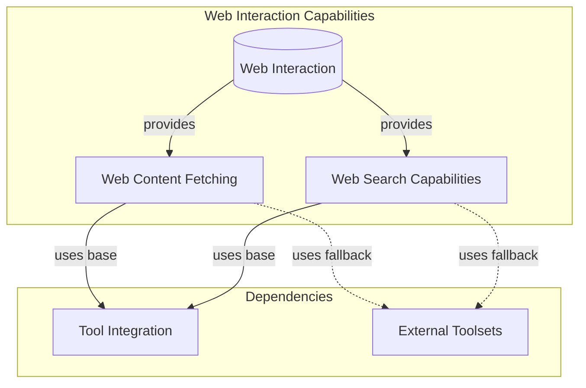

# Capabilities: Web Interaction Module

## Introduction

The `capabilities_web_interaction` module provides intelligent agents with the ability to interact with the web, encompassing functionalities like fetching content from URLs and performing web searches. These capabilities are crucial for agents that need to gather real-time information, process external web content, or augment their knowledge base directly from the internet.

This module abstracts the complexity of web interaction, offering a consistent interface whether the underlying mechanism is a model's native (builtin) web tool or a local fallback implementation.

## Architecture Overview

This module is built around two primary capabilities: `WebFetch` for retrieving web content and `WebSearch` for performing web queries. Both capabilities are designed to leverage either a model's native tool support for these operations or a local fallback mechanism when native support is unavailable or undesirable. This dual-approach ensures robust web interaction across different agent configurations and model types.

`WebFetch` focuses on directly accessing and extracting content from specified URLs, while `WebSearch` enables agents to query the internet for information, often utilizing search engines like DuckDuckGo for local fallbacks or model-specific search integrations.

Both `WebFetch` and `WebSearch` inherit from `BuiltinOrLocalTool`, found in the [capabilities_tool_integration.md](capabilities_tool_integration.md) module, which provides the foundational logic for switching between builtin and local tool implementations. For their local fallback mechanisms, they may integrate with various external toolsets, as detailed in [external_toolset_integrations.md](external_toolset_integrations.md).

<!-- DIAGRAM_JSON
{
    "direction": "TD",
    "nodes": [
        {"id": "capabilities_web_interaction_node", "label": "Web Interaction", "type": "module"},
        {"id": "web_fetching", "label": "Web Content Fetching", "type": "module", "link": "web_fetching.md"},
        {"id": "web_searching", "label": "Web Search Capabilities", "type": "module", "link": "web_searching.md"},
        {"id": "capabilities_tool_integration", "label": "Tool Integration", "type": "external", "link": "capabilities_tool_integration.md"},
        {"id": "external_toolset_integrations", "label": "External Toolsets", "type": "external", "link": "external_toolset_integrations.md"}
    ],
    "edges": [
        {"source": "capabilities_web_interaction_node", "target": "web_fetching", "label": "provides"},
        {"source": "capabilities_web_interaction_node", "target": "web_searching", "label": "provides"},
        {"source": "web_fetching", "target": "capabilities_tool_integration", "label": "uses base"},
        {"source": "web_searching", "target": "capabilities_tool_integration", "label": "uses base"},
        {"source": "web_fetching", "target": "external_toolset_integrations", "label": "uses fallback"},
        {"source": "web_searching", "target": "external_toolset_integrations", "label": "uses fallback"}
    ],
    "groups": [
        {
            "id": "web_interaction_group",
            "label": "Web Interaction Capabilities",
            "role": "surface",
            "nodes": ["capabilities_web_interaction_node", "web_fetching", "web_searching"]
        },
        {
            "id": "dependencies",
            "label": "Dependencies",
            "role": "analytical",
            "nodes": ["capabilities_tool_integration", "external_toolset_integrations"]
        }
    ]
}
-->

## Sub-modules

### [Web Content Fetching](web_fetching.md)

The `web_fetching` sub-module is responsible for handling the retrieval of content from specified URLs. It provides robust mechanisms for fetching web pages, allowing for control over allowed and blocked domains, maximum usage, and content length. This ensures agents can efficiently and safely access external web resources.

### [Web Search Capabilities](web_searching.md)

The `web_searching` sub-module equips agents with the ability to perform web searches. It supports various configurations such as controlling the search context size, localizing results, and filtering by allowed or blocked domains. This enables agents to intelligently query the internet to gather relevant information and enhance their decision-making processes.
