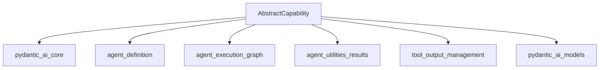

# capability_core

## Introduction

The `capability_core` module defines the `AbstractCapability` class, serving as the foundational building block for creating reusable and composable units of agent behavior within the pydantic_ai framework. Capabilities allow developers to encapsulate instructions, model settings, tools, and request/response hooks, enabling modular and extensible agent designs.

## Architecture and Component Relationships

The `AbstractCapability` class provides a rich set of lifecycle hooks and methods that allow for fine-grained control over various stages of an agent's execution, including run initialization, node execution, model interaction, and tool validation/execution. It acts as an extension point for customizing agent behavior without altering the core agent logic.

<!-- DIAGRAM_JSON
{
    "direction": "TD",
    "nodes": [
        {"id": "abstract_capability", "label": "AbstractCapability", "type": "component", "link": null},
        {"id": "pydantic_ai_core", "label": "pydantic_ai_core", "type": "external", "link": "pydantic_ai_core.md"},
        {"id": "agent_definition", "label": "agent_definition", "type": "external", "link": "agent_definition.md"},
        {"id": "agent_execution_graph", "label": "agent_execution_graph", "type": "external", "link": "agent_execution_graph.md"},
        {"id": "agent_utilities_results", "label": "agent_utilities_results", "type": "external", "link": "agent_utilities_results.md"},
        {"id": "tool_output_management", "label": "tool_output_management", "type": "external", "link": "tool_output_management.md"},
        {"id": "pydantic_ai_models", "label": "pydantic_ai_models", "type": "external", "link": "pydantic_ai_models.md"}
    ],
    "edges": [
        {"source": "abstract_capability", "target": "pydantic_ai_core"},
        {"source": "abstract_capability", "target": "agent_definition"},
        {"source": "abstract_capability", "target": "agent_execution_graph"},
        {"source": "abstract_capability", "target": "agent_utilities_results"},
        {"source": "abstract_capability", "target": "tool_output_management"},
        {"source": "abstract_capability", "target": "pydantic_ai_models"}
    ],
    "groups": []
}
-->

## Core Functionality

The `AbstractCapability` class is the cornerstone for defining custom agent behaviors. It outlines a comprehensive set of methods and hooks that can be overridden by concrete capability implementations.

### `AbstractCapability`

`pydantic_ai_slim.pydantic_ai.capabilities.abstract.AbstractCapability`

This abstract base class provides the blueprint for agent capabilities. Capabilities are designed to be modular and can provide various aspects of agent configuration and behavior.

**Key Concepts:**

*   **Reusable and Composable:** Capabilities can be combined to build complex agent behaviors.
*   **Lifecycle Hooks:** The class defines a series of asynchronous methods that act as hooks, allowing custom logic to be injected at different stages of an agent's execution. These stages include:
    *   **Agent Construction:** `get_instructions`, `get_model_settings`, `get_toolset`, `get_builtin_tools` are called to collect static configuration.
    *   **Per-Run Initialization:** `for_run`, `get_wrapper_toolset` are called per agent run.
    *   **Run Lifecycle:** `before_run`, `after_run`, `wrap_run`, `on_run_error` provide hooks for the entire agent run.
    *   **Node Run Lifecycle:** `before_node_run`, `after_node_run`, `wrap_node_run`, `on_node_run_error` allow interaction with individual graph node executions.
    *   **Event Stream:** `wrap_run_event_stream` enables observation or transformation of streamed events.
    *   **Model Request Lifecycle:** `before_model_request`, `after_model_request`, `wrap_model_request`, `on_model_request_error` provide control over interactions with the language model.
    *   **Tool Validation Lifecycle:** `before_tool_validate`, `after_tool_validate`, `wrap_tool_validate`, `on_tool_validate_error` allow modification and error handling during tool argument validation.
    *   **Tool Execution Lifecycle:** `before_tool_execute`, `after_tool_execute`, `wrap_tool_execute`, `on_tool_execute_error` provide hooks for tool execution and result modification.
*   **Serialization:** Supports YAML/JSON specs for agent construction via `get_serialization_name` and `from_spec`.

**Key Methods:**

*   **`@property has_wrap_node_run`**: Indicates if the `wrap_node_run` method is overridden.
*   **`@classmethod get_serialization_name()`**: Returns the name used for spec serialization (default is the class name). Returns `None` to opt out of spec-based construction.
*   **`@classmethod from_spec(*args: Any, **kwargs: Any) -> AbstractCapability[Any]`**: Creates a capability instance from spec arguments. Useful for handling non-serializable types in `__init__`.
*   **`async for_run(self, ctx: RunContext[AgentDepsT]) -> AbstractCapability[AgentDepsT]`**: Returns the capability instance to be used for a specific agent run. Useful for per-run state isolation.
*   **`get_instructions(self) -> AgentInstructions[AgentDepsT] | None`**: Provides instructions to be included in the system prompt.
*   **`get_model_settings(self) -> AgentModelSettings[AgentDepsT] | None`**: Provides model settings to be merged with the agent's defaults.
*   **`get_toolset(self) -> AgentToolset[AgentDepsT] | None`**: Registers a toolset with the agent.
*   **`get_builtin_tools(self) -> Sequence[AgentBuiltinTool[AgentDepsT]]`**: Registers builtin tools with the agent.
*   **`get_wrapper_toolset(self, toolset: AbstractToolset[AgentDepsT]) -> AbstractToolset[AgentDepsT] | None`**: Allows wrapping the agent's assembled toolset. This is called per-run.
*   **`async prepare_tools(self, ctx: RunContext[AgentDepsT], tool_defs: list[ToolDefinition]) -> list[ToolDefinition]`**: Filters or modifies tool definitions before they are visible to the model.
*   **Run Lifecycle Hooks**:
    *   `async before_run(self, ctx: RunContext[AgentDepsT]) -> None`: Called before the agent run starts.
    *   `async after_run(self, ctx: RunContext[AgentDepsT], *, result: AgentRunResult[Any]) -> AgentRunResult[Any]`: Called after the agent run completes successfully. Can modify the result.
    *   `async wrap_run(self, ctx: RunContext[AgentDepsT], *, handler: WrapRunHandler) -> AgentRunResult[Any]`: Wraps the entire agent run execution.
    *   `async on_run_error(self, ctx: RunContext[AgentDepsT], *, error: BaseException) -> AgentRunResult[Any]`: Called when the agent run fails. Allows error suppression or propagation.
*   **Node Run Lifecycle Hooks**:
    *   `async before_node_run(self, ctx: RunContext[AgentDepsT], *, node: AgentNode[AgentDepsT]) -> AgentNode[AgentDepsT]`: Called before each graph node executes.
    *   `async after_node_run(self, ctx: RunContext[AgentDepsT], *, node: AgentNode[AgentDepsT], result: NodeResult[AgentDepsT]) -> NodeResult[AgentDepsT]`: Called after each graph node succeeds.
    *   `async wrap_node_run(self, ctx: RunContext[AgentDepsT], *, node: AgentNode[AgentDepsT], handler: WrapNodeRunHandler[AgentDepsT]) -> NodeResult[AgentDepsT]`: Wraps execution of each agent graph node.
    *   `async on_node_run_error(self, ctx: RunContext[AgentDepsT], *, node: AgentNode[AgentDepsT], error: Exception) -> NodeResult[AgentDepsT]`: Called when a graph node fails. Allows error recovery.
*   **Event Stream Hook**:
    *   `async wrap_run_event_stream(self, ctx: RunContext[AgentDepsT], *, stream: AsyncIterable[AgentStreamEvent]) -> AsyncIterable[AgentStreamEvent]`: Wraps the event stream for streamed nodes.
*   **Model Request Lifecycle Hooks**:
    *   `async before_model_request(self, ctx: RunContext[AgentDepsT], request_context: ModelRequestContext) -> ModelRequestContext`: Called before each model request.
    *   `async after_model_request(self, ctx: RunContext[AgentDepsT], *, request_context: ModelRequestContext, response: ModelResponse) -> ModelResponse`: Called after each model response.
    *   `async wrap_model_request(self, ctx: RunContext[AgentDepsT], *, request_context: ModelRequestContext, handler: WrapModelRequestHandler) -> ModelResponse`: Wraps the model request execution.
    *   `async on_model_request_error(self, ctx: RunContext[AgentDepsT], *, request_context: ModelRequestContext, error: Exception) -> ModelResponse`: Called when a model request fails.
*   **Tool Validate Lifecycle Hooks**:
    *   `async before_tool_validate(self, ctx: RunContext[AgentDepsT], *, call: ToolCallPart, tool_def: ToolDefinition, args: RawToolArgs) -> RawToolArgs`: Modifies raw arguments before validation.
    *   `async after_tool_validate(self, ctx: RunContext[AgentDepsT], *, call: ToolCallPart, tool_def: ToolDefinition, args: ValidatedToolArgs) -> ValidatedToolArgs`: Modifies validated arguments after successful validation.
    *   `async wrap_tool_validate(self, ctx: RunContext[AgentDepsT], *, call: ToolCallPart, tool_def: ToolDefinition, args: RawToolArgs, handler: WrapToolValidateHandler) -> ValidatedToolArgs`: Wraps tool argument validation.
    *   `async on_tool_validate_error(self, ctx: RunContext[AgentDepsT], *, call: ToolCallPart, tool_def: ToolDefinition, args: RawToolArgs, error: ValidationError | ModelRetry) -> ValidatedToolArgs`: Called when tool argument validation fails.
*   **Tool Execute Lifecycle Hooks**:
    *   `async before_tool_execute(self, ctx: RunContext[AgentDepsT], *, call: ToolCallPart, tool_def: ToolDefinition, args: ValidatedToolArgs) -> ValidatedToolArgs`: Modifies validated arguments before tool execution.
    *   `async after_tool_execute(self, ctx: RunContext[AgentDepsT], *, call: ToolCallPart, tool_def: ToolDefinition, args: ValidatedToolArgs, result: Any) -> Any`: Modifies the result after tool execution.
    *   `async wrap_tool_execute(self, ctx: RunContext[AgentDepsT], *, call: ToolCallPart, tool_def: ToolDefinition, args: ValidatedToolArgs, handler: WrapToolExecuteHandler) -> Any`: Wraps tool execution.
    *   `async on_tool_execute_error(self, ctx: RunContext[AgentDepsT], *, call: ToolCallPart, tool_def: ToolDefinition, args: ValidatedToolArgs, error: Exception) -> Any`: Called when tool execution fails.
*   **`prefix_tools(self, prefix: str) -> PrefixTools[AgentDepsT]`**: Returns a new capability that wraps the current one and prefixes its tool names.

## How the Module Fits into the Overall System

The `capability_core` module, specifically `AbstractCapability`, is a fundamental abstraction within the pydantic_ai framework. It enables the creation of modular and extensible AI agents by providing a standardized interface for injecting custom logic and configurations.

Other modules heavily rely on this core capability concept:

*   **[pydantic_ai_core](pydantic_ai_core.md)**: This module defines core agent concepts like `Agent`, `RunContext`, and various data structures (`AgentInstructions`, `AgentModelSettings`, `AgentToolset`, `ToolDefinition`, `AgentBuiltinTool`, `AgentRunResult`, `NodeResult`, `AgentNode`, `AgentStreamEvent`, `ModelRequestContext`, `ModelResponse`, `ToolCallPart`, `RawToolArgs`, `ValidatedToolArgs`, `ModelRetry`, `ValidationError`) that are extensively used as parameters and return types within `AbstractCapability`'s methods.
    *   **[agent_definition](agent_definition.md)**: Leverages `AbstractCapability` for defining and instantiating agent capabilities.
    *   **[agent_execution_graph](agent_execution_graph.md)**: The lifecycle hooks related to node execution (`before_node_run`, `after_node_run`, `wrap_node_run`, `on_node_run_error`) directly interact with the agent's execution graph.
    *   **[agent_utilities_results](agent_utilities_results.md)**: Deals with agent run results (`AgentRunResult`) and stream events (`AgentStreamEvent`) which are handled by `AbstractCapability`'s lifecycle methods.
    *   **[tool_output_management](tool_output_management.md)**: Provides the `AbstractToolset` and `ToolDefinition` types that are central to capability's tool management hooks.
*   **[pydantic_ai_models](pydantic_ai_models.md)**: The model interaction hooks (`before_model_request`, `after_model_request`, `wrap_model_request`, `on_model_request_error`) directly involve `ModelRequestContext` and `ModelResponse` from this module.
*   **[pydantic_ai_capabilities](pydantic_ai_capabilities.md)**: This parent module contains concrete implementations of `AbstractCapability`, demonstrating how to extend and utilize this core abstraction for specific agent behaviors (e.g., `HistoryProcessor`, `Thinking`, `WebFetch`).
