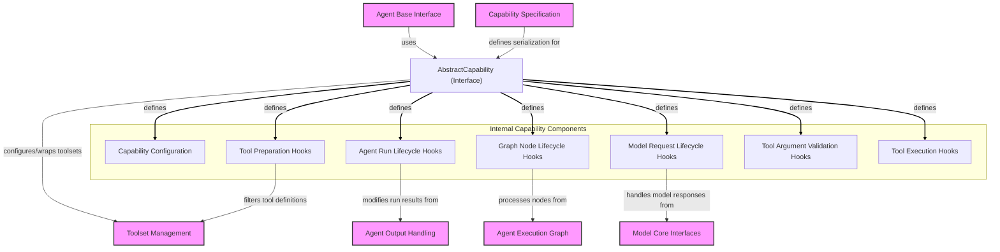

# Capability Interface Module

The `capability_interface` module defines `AbstractCapability`, the foundational interface for creating reusable and composable units of behavior within an agent. These capabilities are crucial for extending an agent's functionality by providing custom instructions, model settings, tools, and hooks that intervene at various stages of an agent's operation, from initial setup to model requests and tool executions.

By implementing `AbstractCapability`, developers can encapsulate specific functionalities, such as managing conversation history, integrating with external tools, or implementing custom error recovery logic, ensuring a modular and organized agent architecture. This module provides the blueprint for how these capabilities interact with the core agent system, enabling powerful customization and extensibility without modifying the agent's core logic.

## Architecture

<!-- DIAGRAM_JSON
{
    "direction": "TD",
    "nodes": [
        {"id": "abstract_capability", "label": "AbstractCapability (Interface)", "type": "component"},
        {"id": "capability_config", "label": "Capability Configuration", "type": "component"},
        {"id": "tool_prep", "label": "Tool Preparation Hooks", "type": "component"},
        {"id": "run_hooks", "label": "Agent Run Lifecycle Hooks", "type": "component"},
        {"id": "node_hooks", "label": "Graph Node Lifecycle Hooks", "type": "component"},
        {"id": "model_hooks", "label": "Model Request Lifecycle Hooks", "type": "component"},
        {"id": "tool_validation_hooks", "label": "Tool Argument Validation Hooks", "type": "component"},
        {"id": "tool_execution_hooks", "label": "Tool Execution Hooks", "type": "component"},
        {"id": "agent_base_interface", "label": "Agent Base Interface", "type": "external", "link": "agent_base_interface.md"},
        {"id": "capability_spec", "label": "Capability Specification", "type": "external", "link": "capability_specification.md"},
        {"id": "toolset_management", "label": "Toolset Management", "type": "external", "link": "toolset_management.md"},
        {"id": "agent_execution_graph", "label": "Agent Execution Graph", "type": "external", "link": "agent_execution_graph.md"},
        {"id": "agent_output_handling", "label": "Agent Output Handling", "type": "external", "link": "agent_output_handling.md"},
        {"id": "model_core_interfaces", "label": "Model Core Interfaces", "type": "external", "link": "model_core_interfaces.md"}
    ],
    "edges": [
        {"source": "abstract_capability", "target": "capability_config", "label": "defines"},
        {"source": "abstract_capability", "target": "tool_prep", "label": "defines"},
        {"source": "abstract_capability", "target": "run_hooks", "label": "defines"},
        {"source": "abstract_capability", "target": "node_hooks", "label": "defines"},
        {"source": "abstract_capability", "target": "model_hooks", "label": "defines"},
        {"source": "abstract_capability", "target": "tool_validation_hooks", "label": "defines"},
        {"source": "abstract_capability", "target": "tool_execution_hooks", "label": "defines"},

        {"source": "agent_base_interface", "target": "abstract_capability", "label": "uses"},
        {"source": "capability_spec", "target": "abstract_capability", "label": "defines serialization for"},
        {"source": "abstract_capability", "target": "toolset_management", "label": "configures/wraps toolsets"},
        {"source": "node_hooks", "target": "agent_execution_graph", "label": "processes nodes from"},
        {"source": "run_hooks", "target": "agent_output_handling", "label": "modifies run results from"},
        {"source": "model_hooks", "target": "model_core_interfaces", "label": "handles model responses from"},
        {"source": "tool_prep", "target": "toolset_management", "label": "filters tool definitions"}
    ],
    "groups": [
        {
            "id": "internal_components",
            "label": "Internal Capability Components",
            "role": "analytical",
            "nodes": [
                "capability_config",
                "tool_prep",
                "run_hooks",
                "node_hooks",
                "model_hooks",
                "tool_validation_hooks",
                "tool_execution_hooks"
            ]
        }
    ]
}
-->


## Core Components

The `capability_interface` module is built around the `AbstractCapability` class, which serves as the primary extension point for custom agent behaviors.

### `AbstractCapability`

The `AbstractCapability` class is an abstract base class that defines the full lifecycle and interaction points for any agent capability. It provides a comprehensive set of methods (hooks) that allow developers to inject custom logic at various stages of an agent's operation:

*   **Configuration Methods:**
    *   `get_serialization_name()`: Returns the name used for spec serialization.
    *   `from_spec()`: Creates a capability instance from spec arguments, allowing for declarative configuration.
    *   `for_run()`: Provides a capability instance specific to a single agent run, enabling per-run state isolation.
    *   `get_instructions()`: Returns instructions to be included in the system prompt. Refer to the [agent_base_interface.md](agent_base_interface.md) for details on agent instructions.
    *   `get_model_settings()`: Returns model settings to merge with the agent's defaults.
    *   `get_toolset()`: Registers a toolset with the agent. See [toolset_management.md](toolset_management.md) for more on toolsets.
    *   `get_builtin_tools()`: Registers built-in tools.
    *   `get_wrapper_toolset()`: Allows wrapping the agent's assembled toolset. This is useful for applying cross-cutting concerns like filtering or modifying tool availability.

*   **Tool Preparation Hook:**
    *   `prepare_tools()`: Filters or modifies the list of tool definitions visible to the model for a given step. This interacts closely with the [toolset_management.md](toolset_management.md) module.

*   **Agent Run Lifecycle Hooks:** These methods provide control over the entire agent run.
    *   `before_run()`: Called before the agent run starts (observe-only).
    *   `after_run()`: Called after the agent run completes successfully, allowing modification of the [agent_output_handling.md](agent_output_handling.md) result.
    *   `wrap_run()`: Wraps the entire agent run, enabling advanced control flow, error recovery, or short-circuiting the run.
    *   `on_run_error()`: Handles exceptions that occur during an agent run, allowing for custom error handling or recovery.

*   **Graph Node Lifecycle Hooks:** These hooks provide granular control over the execution of individual nodes within the agent's execution graph. For more information on agent graphs, refer to [agent_execution_graph.md](agent_execution_graph.md).
    *   `before_node_run()`: Called before each graph node executes, allowing observation or replacement of the node.
    *   `after_node_run()`: Called after each graph node succeeds, enabling modification of the result or redirection of graph progression.
    *   `wrap_node_run()`: Wraps the execution of each agent graph node, useful for retries, inspection, or modifying graph flow.
    *   `on_node_run_error()`: Handles exceptions during node execution, allowing for recovery or redirection.
    *   `wrap_run_event_stream()`: Wraps the event stream for streamed nodes, enabling observation or transformation of events.

*   **Model Request Lifecycle Hooks:** These methods allow intervention before and after interactions with the underlying language model. Refer to [model_core_interfaces.md](model_core_interfaces.md) for details on `ModelResponse`.
    *   `before_model_request()`: Called before each model request, allowing modification of messages, settings, or parameters.
    *   `after_model_request()`: Called after receiving a model response, enabling modification of the response or retrying the request.
    *   `wrap_model_request()`: Wraps the model request itself, providing a point for custom request handling or logging.
    *   `on_model_request_error()`: Handles exceptions during a model request, allowing for retry logic or custom error responses.

*   **Tool Validation Lifecycle Hooks:** These hooks control the validation process of tool arguments before execution.
    *   `before_tool_validate()`: Modifies raw arguments before validation.
    *   `after_tool_validate()`: Modifies validated arguments after successful validation.
    *   `wrap_tool_validate()`: Wraps the entire tool argument validation process.
    *   `on_tool_validate_error()`: Handles validation errors, allowing for custom error messages or retry mechanisms.

*   **Tool Execution Lifecycle Hooks:** These hooks manage the execution of tools and their results.
    *   `before_tool_execute()`: Modifies validated arguments before tool execution.
    *   `after_tool_execute()`: Modifies the result after tool execution.
    *   `wrap_tool_execute()`: Wraps the tool execution process, enabling retries, logging, or custom handling of tool calls.
    *   `on_tool_execute_error()`: Handles exceptions during tool execution, allowing for recovery or custom error results.

*   **Convenience Methods:**
    *   `prefix_tools()`: Returns a new capability that wraps the current one and prefixes its tool names, helping to avoid naming conflicts in agents with many tools.

## Relationship to Other Modules

*   **[Agent Base Interface](agent_base_interface.md)**: The `AbstractCapability` is designed to be integrated into `AbstractAgent` implementations, providing the core mechanism for extending agent behavior.
*   **[Capability Specification](capability_specification.md)**: This module defines how capabilities can be serialized and deserialized using `CapabilitySpec`, making agents configurable via YAML/JSON.
*   **[Toolset Management](toolset_management.md)**: Capabilities extensively interact with toolsets, providing new tools, filtering existing ones, and wrapping their execution.
*   **[Agent Execution Graph](agent_execution_graph.md)**: The node lifecycle hooks within `AbstractCapability` provide direct control over the `AgentNode` execution within the agent's internal graph.
*   **[Agent Output Handling](agent_output_handling.md)**: Capabilities can modify `AgentRunResult` and interact with `AgentStreamEvent` during and after agent runs.
*   **[Model Core Interfaces](model_core_interfaces.md)**: Capabilities can intercept and modify `ModelRequestContext` and `ModelResponse` objects, influencing how the agent interacts with LLMs.The `capability_interface` module defines `AbstractCapability`, the foundational interface for creating reusable and composable units of behavior within an agent. These capabilities are crucial for extending an agent\'s functionality by providing custom instructions, model settings, tools, and hooks that intervene at various stages of an agent\'s operation, from initial setup to model requests and tool executions.

By implementing `AbstractCapability`, developers can encapsulate specific functionalities, such as managing conversation history, integrating with external tools, or implementing custom error recovery logic, ensuring a modular and organized agent architecture. This module provides the blueprint for how these capabilities interact with the core agent system, enabling powerful customization and extensibility without modifying the agent\'s core logic.

## Architecture

<!-- DIAGRAM_JSON
{
    \"direction\": \"TD\",
    \"nodes\": [
        {\"id\": \"abstract_capability\", \"label\": \"AbstractCapability (Interface)\", \"type\": \"component\"},
        {\"id\": \"capability_config\", \"label\": \"Capability Configuration\", \"type\": \"component\"},
        {\"id\": \"tool_prep\", \"label\": \"Tool Preparation Hooks\", \"type\": \"component\"},
        {\"id\": \"run_hooks\", \"label\": \"Agent Run Lifecycle Hooks\", \"type\": \"component\"},
        {\"id\": \"node_hooks\", \"label\": \"Graph Node Lifecycle Hooks\", \"type\": \"component\"},
        {\"id\": \"model_hooks\", \"label\": \"Model Request Lifecycle Hooks\", \"type\": \"component\"},
        {\"id\": \"tool_validation_hooks\", \"label\": \"Tool Argument Validation Hooks\", \"type\": \"component\"},
        {\"id\": \"tool_execution_hooks\", \"label\": \"Tool Execution Hooks\", \"type\": \"component\"},
        {\"id\": \"agent_base_interface\", \"label\": \"Agent Base Interface\", \"type\": \"external\", \"link\": \"agent_base_interface.md\"},
        {\"id\": \"capability_spec\", \"label\": \"Capability Specification\", \"type\": \"external\", \"link\": \"capability_specification.md\"},
        {\"id\": \"toolset_management\", \"label\": \"Toolset Management\", \"type\": \"external\", \"link\": \"toolset_management.md\"},
        {\"id\": \"agent_execution_graph\", \"label\": \"Agent Execution Graph\", \"type\": \"external\", \"link\": \"agent_execution_graph.md\"},
        {\"id\": \"agent_output_handling\", \"label\": \"Agent Output Handling\", \"type\": \"external\", \"link\": \"agent_output_handling.md\"},
        {\"id\": \"model_core_interfaces\", \"label\": \"Model Core Interfaces\", \"type\": \"external\", \"link\": \"model_core_interfaces.md\"}
    ],
    \"edges\": [
        {\"source\": \"abstract_capability\", \"target\": \"capability_config\", \"label\": \"defines\"},
        {\"source\": \"abstract_capability\", \"target\": \"tool_prep\", \"label\": \"defines\"},
        {\"source\": \"abstract_capability\", \"target\": \"run_hooks\", \"label\": \"defines\"},
        {\"source\": \"abstract_capability\", \"target\": \"node_hooks\", \"label\": \"defines\"},\
        {\"source\": \"abstract_capability\", \"target\": \"model_hooks\", \"label\": \"defines\"},
        {\"source\": \"abstract_capability\", \"target\": \"tool_validation_hooks\", \"label\": \"defines\"},
        {\"source\": \"abstract_capability\", \"target\": \"tool_execution_hooks\", \"label\": \"defines\"},

        {\"source\": \"agent_base_interface\", \"target\": \"abstract_capability\", \"label\": \"uses\"},
        {\"source\": \"capability_spec\", \"target\": \"abstract_capability\", \"label\": \"defines serialization for\"},
        {\"source\": \"abstract_capability\", \"target\": \"toolset_management\", \"label\": \"configures/wraps toolsets\"},
        {\"source\": \"node_hooks\", \"target\": \"agent_execution_graph\", \"label\": \"processes nodes from\"},
        {\"source\": \"run_hooks\", \"target\": \"agent_output_handling\", \"label\": \"modifies run results from\"},
        {\"source\": \"model_hooks\", \"target\": \"model_core_interfaces\", \"label\": \"handles model responses from\"},
        {\"source\": \"tool_prep\", \"target\": \"toolset_management\", \"label\": \"filters tool definitions\"}
    ],
    \"groups\": [
        {
            \"id\": \"internal_components\",
            \"label\": \"Internal Capability Components\",
            \"role\": \"analytical\",
            \"nodes\": [
                \"capability_config\",
                \"tool_prep\",
                \"run_hooks\",
                \"node_hooks\",
                \"model_hooks\",
                \"tool_validation_hooks\",
                \"tool_execution_hooks\"
            ]
        }
    ]
}
-->
```mermaid
flowchart TD
    subgraph internal_components[\"Internal Capability Components\"]
        capability_config[\"Capability Configuration\"]
        tool_prep[\"Tool Preparation Hooks\"]
        run_hooks[\"Agent Run Lifecycle Hooks\"]
        node_hooks[\"Graph Node Lifecycle Hooks\"]
        model_hooks[\"Model Request Lifecycle Hooks\"]
        tool_validation_hooks[\"Tool Argument Validation Hooks\"]
        tool_execution_hooks[\"Tool Execution Hooks\"]
    end

    abstract_capability[\"AbstractCapability (Interface)\"]

    agent_base_interface[\"Agent Base Interface\"]:::external
    capability_spec[\"Capability Specification\"]:::external
    toolset_management[\"Toolset Management\"]:::external
    agent_execution_graph[\"Agent Execution Graph\"]:::external
    agent_output_handling[\"Agent Output Handling\"]:::external
    model_core_interfaces[\"Model Core Interfaces\"]:::external

    %% Internal Capability Components connections
    abstract_capability -->|\"defines\"| capability_config
    abstract_capability -->|\"defines\"| tool_prep
    abstract_capability -->|\"defines\"| run_hooks
    abstract_capability -->|\"defines\"| node_hooks
    abstract_capability -->|\"defines\"| model_hooks
    abstract_capability -->|\"defines\"| tool_validation_hooks
    abstract_capability -->|\"defines\"| tool_execution_hooks

    %% External Dependencies
    agent_base_interface -->|\"uses\"| abstract_capability
    capability_spec -->|\"defines serialization for\"| abstract_capability
    abstract_capability -->|\"configures/wraps toolsets\"| toolset_management
    node_hooks -->|\"processes nodes from\"| agent_execution_graph
    run_hooks -->|\"modifies run results from\"| agent_output_handling
    model_hooks -->|\"handles model responses from\"| model_core_interfaces
    tool_prep -->|\"filters tool definitions\"| toolset_management

    linkStyle 0 stroke-width:2px,fill:none,stroke:black;
    linkStyle 1 stroke-width:2px,fill:none,stroke:black;
    linkStyle 2 stroke-width:2px,fill:none,stroke:black;
    linkStyle 3 stroke-width:2px,fill:none,stroke:black;
    linkStyle 4 stroke-width:2px,fill:none,stroke:black;
    linkStyle 5 stroke-width:2px,fill:none,stroke:black;
    linkStyle 6 stroke-width:2px,fill:none,stroke:black;
    classDef external fill:#f9f,stroke:#333,stroke-width:2px;
```

## Core Components

The `capability_interface` module is built around the `AbstractCapability` class, which serves as the primary extension point for custom agent behaviors.

### `AbstractCapability`

The `AbstractCapability` class is an abstract base class that defines the full lifecycle and interaction points for any agent capability. It provides a comprehensive set of methods (hooks) that allow developers to inject custom logic at various stages of an agent\'s operation:

*   **Configuration Methods:**
    *   `get_serialization_name()`: Returns the name used for spec serialization.
    *   `from_spec()`: Creates a capability instance from spec arguments, allowing for declarative configuration.
    *   `for_run()`: Provides a capability instance specific to a single agent run, enabling per-run state isolation.
    *   `get_instructions()`: Returns instructions to be included in the system prompt. Refer to the [agent_base_interface.md](agent_base_interface.md) for details on agent instructions.
    *   `get_model_settings()`: Returns model settings to merge with the agent\'s defaults.
    *   `get_toolset()`: Registers a toolset with the agent. See [toolset_management.md](toolset_management.md) for more on toolsets.
    *   `get_builtin_tools()`: Registers built-in tools.
    *   `get_wrapper_toolset()`: Allows wrapping the agent\'s assembled toolset. This is useful for applying cross-cutting concerns like filtering or modifying tool availability.

*   **Tool Preparation Hook:**
    *   `prepare_tools()`: Filters or modifies the list of tool definitions visible to the model for a given step. This interacts closely with the [toolset_management.md](toolset_management.md) module.

*   **Agent Run Lifecycle Hooks:** These methods provide control over the entire agent run.
    *   `before_run()`: Called before the agent run starts (observe-only).
    *   `after_run()`: Called after the agent run completes successfully, allowing modification of the [agent_output_handling.md](agent_output_handling.md) result.
    *   `wrap_run()`: Wraps the entire agent run, enabling advanced control flow, error recovery, or short-circuiting the run.
    *   `on_run_error()`: Handles exceptions that occur during an agent run, allowing for custom error handling or recovery.

*   **Graph Node Lifecycle Hooks:** These hooks provide granular control over the execution of individual nodes within the agent\'s execution graph. For more information on agent graphs, refer to [agent_execution_graph.md](agent_execution_graph.md).
    *   `before_node_run()`: Called before each graph node executes, allowing observation or replacement of the node.
    *   `after_node_run()`: Called after each graph node succeeds, enabling modification of the result or redirection of graph progression.
    *   `wrap_node_run()`: Wraps the execution of each agent graph node, useful for retries, inspection, or modifying graph flow.
    *   `on_node_run_error()`: Handles exceptions during node execution, allowing for recovery or redirection.
    *   `wrap_run_event_stream()`: Wraps the event stream for streamed nodes, enabling observation or transformation of events.

*   **Model Request Lifecycle Hooks:** These methods allow intervention before and after interactions with the underlying language model. Refer to [model_core_interfaces.md](model_core_interfaces.md) for details on `ModelResponse`.
    *   `before_model_request()`: Called before each model request, allowing modification of messages, settings, or parameters.
    *   `after_model_request()`: Called after receiving a model response, enabling modification of the response or retrying the request.
    *   `wrap_model_request()`: Wraps the model request itself, providing a point for custom request handling or logging.
    *   `on_model_request_error()`: Handles exceptions during a model request, allowing for retry logic or custom error responses.

*   **Tool Validation Lifecycle Hooks:** These hooks control the validation process of tool arguments before execution.
    *   `before_tool_validate()`: Modifies raw arguments before validation.
    *   `after_tool_validate()`: Modifies validated arguments after successful validation.
    *   `wrap_tool_validate()`: Wraps the entire tool argument validation process.
    *   `on_tool_validate_error()`: Handles validation errors, allowing for custom error messages or retry mechanisms.

*   **Tool Execution Lifecycle Hooks:** These hooks manage the execution of tools and their results.
    *   `before_tool_execute()`: Modifies validated arguments before tool execution.
    *   `after_tool_execute()`: Modifies the result after tool execution.
    *   `wrap_tool_execute()`: Wraps the tool execution process, enabling retries, logging, or custom handling of tool calls.
    *   `on_tool_execute_error()`: Handles exceptions during tool execution, allowing for recovery or custom error results.

*   **Convenience Methods:**
    *   `prefix_tools()`: Returns a new capability that wraps the current one and prefixes its tool names, helping to avoid naming conflicts in agents with many tools.

## Relationship to Other Modules

*   **[Agent Base Interface](agent_base_interface.md)**: The `AbstractCapability` is designed to be integrated into `AbstractAgent` implementations, providing the core mechanism for extending agent behavior.
*   **[Capability Specification](capability_specification.md)**: This module defines how capabilities can be serialized and deserialized using `CapabilitySpec`, making agents configurable via YAML/JSON.
*   **[Toolset Management](toolset_management.md)**: Capabilities extensively interact with toolsets, providing new tools, filtering existing ones, and wrapping their execution.
*   **[Agent Execution Graph](agent_execution_graph.md)**: The node lifecycle hooks within `AbstractCapability` provide direct control over the `AgentNode` execution within the agent\'s internal graph.
*   **[Agent Output Handling](agent_output_handling.md)**: Capabilities can modify `AgentRunResult` and interact with `AgentStreamEvent` during and after agent runs.
*   **[Model Core Interfaces](model_core_interfaces.md)**: Capabilities can intercept and modify `ModelRequestContext` and `ModelResponse` objects, influencing how the agent interacts with LLMs.