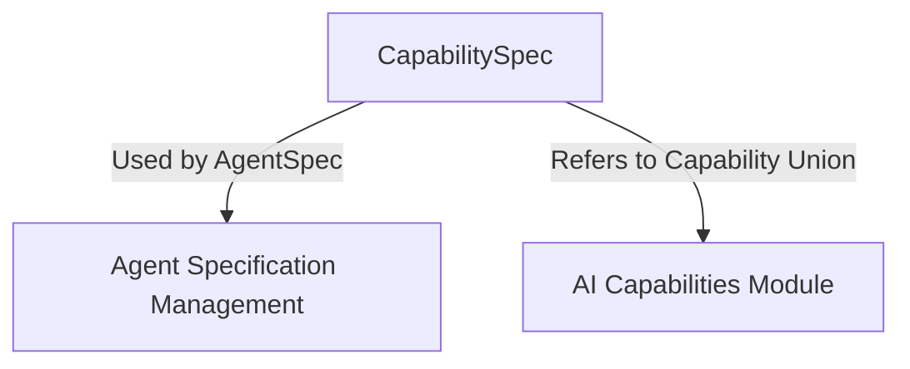

# `capability_spec_definition` Module Documentation

## Introduction

The `capability_spec_definition` module is a fundamental component within the `pydantic_ai_agent_core` system, specifically designed to define and manage the specification of agent capabilities. It plays a crucial role in enabling the system to understand and generate schemas for the various functionalities an AI agent can possess.

## Purpose and Core Functionality

The primary purpose of this module is to provide the `CapabilitySpec` class, which serves as a specialized `NamedSpec` for defining agent capabilities. This distinction is vital for the system's schema generation process. When a field in a JSON schema is typed as `CapabilitySpec`, it signals to the system to replace that field with a comprehensive union of all available capability types, as defined in the `pydantic_ai_capabilities` module.

### `CapabilitySpec`

```python
class CapabilitySpec(NamedSpec):
    """A capability specification, distinguishable from other NamedSpec types for schema generation.

    In JSON schemas, fields typed as CapabilitySpec are replaced with the full
    capability Union (the same set of types used in `AgentSpec.capabilities`).
    """
```

- **Role**: Defines a specification for agent capabilities, specifically tailored for schema generation and validation.
- **Schema Generation**: Facilitates the dynamic generation of JSON schemas by acting as a placeholder that gets expanded into a union of all possible capability types.
- **Integration with Agent Definitions**: Directly influences how capabilities are represented and validated within `AgentSpec` definitions.

## Architecture and Component Relationships

The `capability_spec_definition` module, through its `CapabilitySpec` class, acts as a central definition point for how capabilities are structured and referenced throughout the AI agent system. It primarily interacts with agent specification management and the broader capability definitions.

<!-- DIAGRAM_JSON
{
    "direction": "TD",
    "nodes": [
        {"id": "capability_spec", "label": "CapabilitySpec", "type": "component", "link": null},
        {"id": "agent_spec_management", "label": "Agent Specification Management", "type": "external", "link": "agent_spec_management.md"},
        {"id": "pydantic_ai_capabilities", "label": "AI Capabilities Module", "type": "external", "link": "pydantic_ai_capabilities.md"}
    ],
    "edges": [
        {"source": "capability_spec", "target": "agent_spec_management", "label": "Used by AgentSpec"},
        {"source": "capability_spec", "target": "pydantic_ai_capabilities", "label": "Refers to Capability Union"}
    ],
    "groups": []
}
-->



### Relationships:

*   **`capability_spec` to `agent_spec_management`**: The `CapabilitySpec` is integral to the `AgentSpec` found in the `agent_spec_management` module. `AgentSpec` uses `CapabilitySpec` to define the set of capabilities an agent can have, and during schema generation, `CapabilitySpec` is expanded to include all defined capabilities.
*   **`capability_spec` to `pydantic_ai_capabilities`**: `CapabilitySpec` directly references the "full capability Union" which represents the collection of all available capabilities defined within the `pydantic_ai_capabilities` module. This ensures that when an `AgentSpec` is processed, it correctly incorporates all possible capabilities.

## How the Module Fits into the Overall System

The `capability_spec_definition` module serves as the foundational layer for standardizing how capabilities are declared and integrated into AI agent definitions. By providing a clear and extensible `CapabilitySpec`, it ensures:

1.  **Consistent Capability Representation**: All agents define their capabilities using a common, well-understood structure.
2.  **Automated Schema Generation**: It enables the system to automatically generate accurate and comprehensive JSON schemas for agents, reflecting all available capabilities.
3.  **Type Safety and Validation**: By expanding to the full capability union, it facilitates robust type checking and validation for agent configurations.

This module is crucial for the maintainability and extensibility of the `pydantic_ai_agent_core` system, especially when new capabilities are introduced or existing ones are modified. It acts as a bridge between the abstract definition of a capability and its concrete representation within an agent's specification and the broader toolset provided by the `pydantic_ai_capabilities` module.