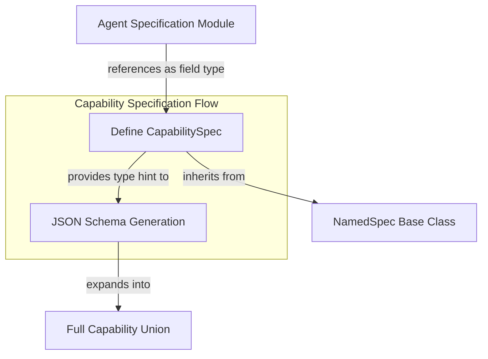

# `capability_specification`

The `capability_specification` module is responsible for defining the `CapabilitySpec`, a core type used throughout the system for specifying and managing agent capabilities. It acts as a crucial marker during JSON schema generation, ensuring that capability fields are correctly represented with the full union of available capability types.

### Module Overview

The `capability_specification` module provides the foundational `CapabilitySpec` class. This class is not an executable capability itself, but rather a declarative specification that allows the system to understand and generate accurate schemas for agent configurations. By inheriting from `NamedSpec`, it integrates seamlessly into the broader naming and specification framework of the AI agent system. Its primary utility lies in enabling the automatic expansion of capability definitions when generating JSON schemas, ensuring that any field typed as `CapabilitySpec` is replaced with the complete set of concrete capability implementations.

This separation of specification from implementation allows for a flexible and extensible capability system, where new capabilities can be added without modifying the core schema generation logic, as long as they adhere to the overall capability structure.

<!-- DIAGRAM_JSON
{
    "direction": "TD",
    "nodes": [
        {"id": "capability_spec_definition", "label": "Define CapabilitySpec", "type": "component", "link": null},
        {"id": "named_spec", "label": "NamedSpec Base Class", "type": "external", "link": null},
        {"id": "agent_spec", "label": "Agent Specification Module", "type": "external", "link": "agent_specification.md"},
        {"id": "schema_generation", "label": "JSON Schema Generation", "type": "component", "link": null},
        {"id": "full_capability_union", "label": "Full Capability Union", "type": "external", "link": "capabilities_base.md"}
    ],
    "edges": [
        {"source": "capability_spec_definition", "target": "named_spec", "label": "inherits from"},
        {"source": "agent_spec", "target": "capability_spec_definition", "label": "references as field type"},
        {"source": "capability_spec_definition", "target": "schema_generation", "label": "provides type hint to"},
        {"source": "schema_generation", "target": "full_capability_union", "label": "expands into"}
    ],
    "groups": [
        {
            "id": "capability_spec_flow",
            "label": "Capability Specification Flow",
            "role": "analytical",
            "nodes": ["capability_spec_definition", "schema_generation"]
        }
    ]
}
-->

### Core Components

#### `CapabilitySpec`
The `CapabilitySpec` class (`pydantic_ai_slim.pydantic_ai._spec.CapabilitySpec`) is a specialized `NamedSpec` designed to serve as a placeholder for capability definitions within larger schemas. Its key features include:
-   **Schema Generation Marker**: When a field within a Pydantic model is annotated with `CapabilitySpec`, the JSON schema generation process automatically recognizes this and replaces `CapabilitySpec` with the actual union of all registered capabilities in the system.
-   **Extensibility**: This mechanism allows for the dynamic inclusion of new capabilities without requiring manual updates to the agent's schema definitions.
-   **Integration with Agent Definitions**: It is primarily utilized within the `AgentSpec` (defined in the [agent_specification.md](agent_specification.md) module) to declare the set of capabilities an agent can possess.

### How it Connects

The `capability_specification` module, through its `CapabilitySpec`, forms a critical link between the abstract definition of capabilities and their concrete representation in agent configurations and generated schemas.

-   **Dependencies on `NamedSpec`**: `CapabilitySpec` inherits from `NamedSpec` (an internal base class, not separately documented here), leveraging its basic properties for named specifications.
-   **Integration with [agent_specification](agent_specification.md)**: The `AgentSpec` module uses `CapabilitySpec` to define the `capabilities` field of an agent, allowing an agent to declare which capabilities it supports. During schema generation for an `AgentSpec`, the `CapabilitySpec` within it is expanded.
-   **Relationship to [capabilities_base](capabilities_base.md)**: The "Full Capability Union" that `CapabilitySpec` expands into is implicitly derived from the various concrete `AbstractCapability` implementations defined and managed within the `capabilities_base` module and its sub-modules. It represents the collective types of all available capabilities.

In essence, `CapabilitySpec` acts as a smart type hint that streamlines the process of defining agents with various capabilities and ensuring their configurations are correctly validated and represented in JSON schemas.