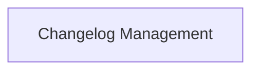

<!-- AUTO_GENERATED_PLACEHOLDER
  reason: LLM did not create .md file for this module
  module_path: project_documentation_and_developer_tools/documentation_site_management/website_content_delivery/changelog_management
  component_count: 2
  generated_at: 2026-04-06T06:47:34.950460
  TODO: Fix LLM prompt to handle small leaf modules
-->

# Changelog Management

> ⚠️ **Auto-Generated Placeholder**
> This documentation was auto-generated because the LLM failed to create it.
> Module path: `project_documentation_and_developer_tools/documentation_site_management/website_content_delivery/changelog_management`

Handles fetching, caching, and formatting release and changelog information from GitHub.

## Components

This module contains 2 component(s):

- `docs-site.src.index.getChangelog`
- `docs-site.src.index.prepRelease`

## Structure

---
*Auto-generated placeholder. See sync_issues.json for details.*
