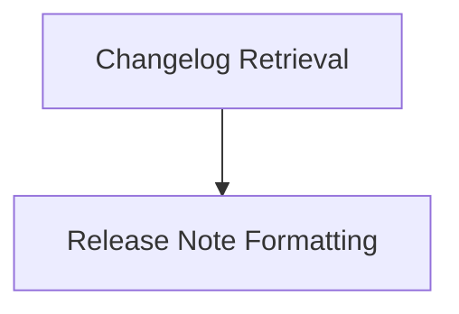

# Changelog Management Module Documentation

## Introduction

The `changelog_management` module is a core component within the `docs_site_utils` system, primarily responsible for retrieving, processing, and formatting release changelog information from GitHub. Its main purpose is to ensure that the documentation site can consistently display up-to-date and well-structured release notes to users. This module handles interactions with the GitHub API for release data and transforms this raw data into a presentable format.

## Architecture Overview

The `changelog_management` module is composed of two key sub-modules that work in conjunction: `get_changelog` and `release_preparation`. The `get_changelog` sub-module focuses on the data acquisition and initial parsing, while the `release_preparation` sub-module refines the fetched data into a standardized display format.

<!-- DIAGRAM_JSON
{
    "direction": "TD",
    "nodes": [
        {"id": "get_changelog", "label": "Changelog Retrieval", "type": "module", "link": "get_changelog.md"},
        {"id": "release_preparation", "label": "Release Note Formatting", "type": "module", "link": "release_preparation.md"}
    ],
    "edges": [
        {"source": "get_changelog", "target": "release_preparation"}
    ],
    "groups": []
}
-->

## High-Level Functionality

### Changelog Retrieval ([`get_changelog.md`](get_changelog.md))

This sub-module is responsible for fetching release information from the GitHub API. It includes functionality for:
- Asynchronously retrieving releases from the `pydantic/pydantic-ai` repository.
- Handling API pagination to ensure all releases are collected.
- Implementing caching mechanisms using `KVNamespace` to reduce redundant API calls and improve load times.
- Utilizing the `marked` library to convert the markdown body of GitHub releases into HTML for rendering.

### Release Note Formatting ([`release_preparation.md`](release_preparation.md))

This sub-module focuses on processing raw GitHub `Release` objects into a consistent and user-friendly markdown format. Its key functions include:
- Standardizing heading levels within the release body.
- Transforming GitHub pull request URLs into concise, clickable links (e.g., `#123`).
- Converting GitHub username mentions into clickable links to user profiles.
- Formatting the "Full Changelog" link with a custom icon and text.
- Generating a complete markdown string for each release, including the release name, formatted body, and a link to the full release on GitHub.
