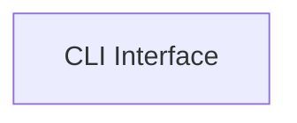

<!-- AUTO_GENERATED_PLACEHOLDER
  reason: LLM did not create .md file for this module
  module_path: project_documentation_and_developer_tools/developer_utility_scripts/cli_interface
  component_count: 1
  generated_at: 2026-04-06T06:47:34.949540
  TODO: Fix LLM prompt to handle small leaf modules
-->

# CLI Interface

> ⚠️ **Auto-Generated Placeholder**
> This documentation was auto-generated because the LLM failed to create it.
> Module path: `project_documentation_and_developer_tools/developer_utility_scripts/cli_interface`

Provides the command-line interface entry point for the 'clai' utility.

## Components

This module contains 1 component(s):

- `clai.clai.__init__.cli`

## Structure

---
*Auto-generated placeholder. See sync_issues.json for details.*
