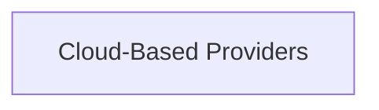

<!-- AUTO_GENERATED_PLACEHOLDER
  reason: LLM did not create .md file for this module
  module_path: pydantic_ai_agent_core/model_provider_configurations/model_provider_integrations/openai_compatible_providers/cloud_based_providers
  component_count: 5
  generated_at: 2026-04-06T06:47:34.933325
  TODO: Fix LLM prompt to handle small leaf modules
-->

# Cloud-Based Providers

> ⚠️ **Auto-Generated Placeholder**
> This documentation was auto-generated because the LLM failed to create it.
> Module path: `pydantic_ai_agent_core/model_provider_configurations/model_provider_integrations/openai_compatible_providers/cloud_based_providers`

Integrations for OpenAI-compatible APIs offered by major cloud platforms and hosted services.

## Components

This module contains 5 component(s):

- `pydantic_ai_slim.pydantic_ai.providers.alibaba.AlibabaProvider`
- `pydantic_ai_slim.pydantic_ai.providers.azure.AzureProvider`
- `pydantic_ai_slim.pydantic_ai.providers.github.GitHubProvider`
- `pydantic_ai_slim.pydantic_ai.providers.ovhcloud.OVHcloudProvider`
- `pydantic_ai_slim.pydantic_ai.providers.heroku.HerokuProvider`

## Structure

---
*Auto-generated placeholder. See sync_issues.json for details.*
