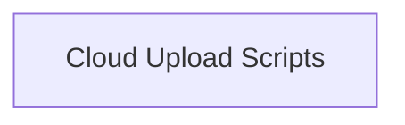

<!-- AUTO_GENERATED_PLACEHOLDER
  reason: LLM did not create .md file for this module
  module_path: project_documentation_and_developer_tools/developer_utility_scripts/cloud_upload_scripts
  component_count: 1
  generated_at: 2026-04-06T06:47:34.949346
  TODO: Fix LLM prompt to handle small leaf modules
-->

# Cloud Upload Scripts

> ⚠️ **Auto-Generated Placeholder**
> This documentation was auto-generated because the LLM failed to create it.
> Module path: `project_documentation_and_developer_tools/developer_utility_scripts/cloud_upload_scripts`

Includes utility scripts for uploading test files to various cloud providers like OpenAI, Anthropic, Google, and Bedrock.

## Components

This module contains 1 component(s):

- `scripts.upload_test_files.main`

## Structure

---
*Auto-generated placeholder. See sync_issues.json for details.*
