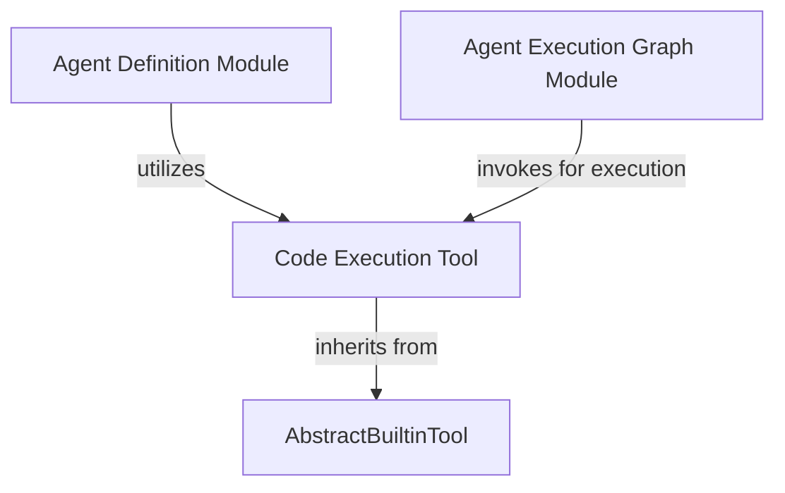

# code_execution_tool

The `code_execution_tool` module provides the `CodeExecutionTool`, a crucial built-in capability that allows AI agents to execute code. This tool enables agents to interact with programming environments, run scripts, and process outputs, making it indispensable for tasks requiring dynamic computation, data manipulation, or system interaction. It is a fundamental component for agents that need to perform actions beyond simple text generation, such as solving coding problems, automating tasks, or integrating with external systems.

## Core Components

The primary component within this module is:

### `CodeExecutionTool`

The `CodeExecutionTool` is a specialized built-in tool designed to facilitate code execution within an AI agent's operational flow. It extends `AbstractBuiltinTool`, inheriting foundational capabilities for integration into the agent framework.

-   **Purpose**: Allows an agent to run arbitrary code, typically Python, in a sandboxed environment. This is vital for agents that need to perform calculations, interact with APIs, process data, or perform any task that can be scripted.
-   **`kind` attribute**: Identified by the string `'code_execution'`, which helps the agent framework correctly dispatch and manage this tool.
-   **Broad Compatibility**: This tool is designed to be compatible with various large language model (LLM) providers, including Anthropic, OpenAI, Google, Bedrock (Nova2.0), and xAI, ensuring its versatility across different AI ecosystems.

## Module Relationships and System Integration

The `code_execution_tool` module plays a vital role in enabling agents to perform active computation. It is integrated into the broader agent ecosystem through its inheritance from `AbstractBuiltinTool` and its utilization by agent definitions and execution graphs.

-   **Inheritance**: It inherits from `AbstractBuiltinTool` (defined in [capabilities_tool_integration](capabilities_tool_integration.md)), which provides the common interface and foundational structure for all built-in tools.
-   **Agent Utilization**: Agents, as defined in the [agent_definition](agent_definition.md) module, can declare and utilize the `CodeExecutionTool` to extend their capabilities to include programmatic execution.
-   **Execution Flow**: When an agent decides to execute code, the `agent_execution_graph` module invokes this tool, orchestrating the actual code execution and capturing its results for the agent's further reasoning.

## Architecture Diagram

<!-- DIAGRAM_JSON
{
    "direction": "TD",
    "nodes": [
        {
            "id": "code_execution_tool_component",
            "label": "Code Execution Tool",
            "type": "component",
            "link": null
        },
        {
            "id": "abstract_builtin_tool",
            "label": "AbstractBuiltinTool",
            "type": "external",
            "link": "capabilities_tool_integration.md"
        },
        {
            "id": "agent_definition",
            "label": "Agent Definition Module",
            "type": "external",
            "link": "agent_definition.md"
        },
        {
            "id": "agent_execution_graph",
            "label": "Agent Execution Graph Module",
            "type": "external",
            "link": "agent_execution_graph.md"
        }
    ],
    "edges": [
        {
            "source": "code_execution_tool_component",
            "target": "abstract_builtin_tool",
            "label": "inherits from"
        },
        {
            "source": "agent_definition",
            "target": "code_execution_tool_component",
            "label": "utilizes"
        },
        {
            "source": "agent_execution_graph",
            "target": "code_execution_tool_component",
            "label": "invokes for execution"
        }
    ],
    "groups": []
}
-->
