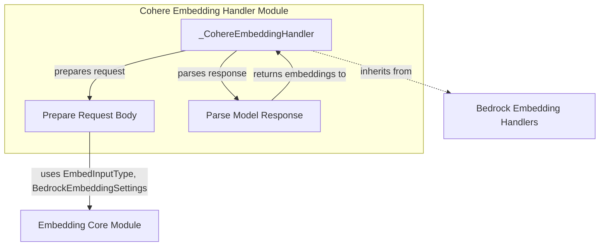

# Cohere Embedding Handler

## Introduction

The `cohere_embedding_handler` module provides the `_CohereEmbeddingHandler` class, which is responsible for interfacing with Cohere embedding models hosted on AWS Bedrock. This handler translates generic embedding requests into the specific format required by Cohere's Bedrock API and parses the responses back into a standardized format. It supports both single and batch embedding requests and handles version-specific parameter variations for Cohere models.

## Core Components

### `_CohereEmbeddingHandler`

```python
class _CohereEmbeddingHandler(_BedrockEmbeddingHandler):
    # ... implementation details ...
```

This class extends the [Bedrock Embedding Handler](bedrock_embedding_handlers.md) and specializes in handling Cohere models. It manages the specific nuances of Cohere's API on the Bedrock platform, including:

*   **Model Versioning**: Differentiates behavior between Cohere v3 and v4+ models, particularly concerning supported parameters like `max_tokens` and `dimensions`.
*   **Request Preparation**: Transforms input texts, `EmbedInputType`, and `BedrockEmbeddingSettings` into the JSON payload expected by the Cohere Bedrock API.
*   **Response Parsing**: Extracts the generated embeddings from the API response and handles various response formats.
*   **Batch Support**: Declares support for batch embedding operations, leveraging the underlying Bedrock capabilities.

#### `prepare_request` Method

```python
def prepare_request(
    self,
    texts: list[str],
    input_type: EmbedInputType,
    settings: BedrockEmbeddingSettings,
) -> dict[str, Any]:
    # ... implementation details ...
```

This method constructs the request body for the Cohere embedding API. Key aspects include:

*   **Input Type Mapping**: Maps the generic `EmbedInputType` (e.g., `document`, `query`) to Cohere-specific `input_type` values (`search_document`, `search_query`) if not explicitly provided in `settings.bedrock_cohere_input_type`.
*   **Parameter Handling**: Conditionally includes `max_tokens` and `output_dimension` based on the Cohere model version (only for v4+). These are silently ignored for v3 models.
*   **Truncation Logic**: Applies truncation settings. `bedrock_cohere_truncate` takes precedence, followed by a general `truncate` setting (defaulting to 'END' if present), otherwise 'NONE'.

#### `parse_response` Method

```python
def parse_response(
    self,
    response_body: dict[str, Any],
) -> tuple[list[Sequence[float]], str | None]:
    # ... implementation details ...
```

This method processes the raw response from the Cohere Bedrock API. It extracts the list of float embeddings, handling cases where embeddings might be nested within a dictionary (`embeddings_by_type` format) or directly provided as a list. If the `embeddings` field is missing or malformed, it raises an `UnexpectedModelBehavior` error.

## Architecture Diagram

<!-- DIAGRAM_JSON
{
    "direction": "TD",
    "nodes": [
        {"id": "cohere_handler", "label": "_CohereEmbeddingHandler", "type": "component", "link": null},
        {"id": "prepare_request", "label": "Prepare Request Body", "type": "component", "link": null},
        {"id": "parse_response", "label": "Parse Model Response", "type": "component", "link": null},
        {"id": "bedrock_handlers", "label": "Bedrock Embedding Handlers", "type": "external", "link": "bedrock_embedding_handlers.md"},
        {"id": "embedding_core", "label": "Embedding Core Module", "type": "external", "link": "embedding_core.md"}
    ],
    "edges": [
        {"source": "cohere_handler", "target": "prepare_request", "label": "prepares request"},
        {"source": "cohere_handler", "target": "parse_response", "label": "parses response"},
        {"source": "cohere_handler", "target": "bedrock_handlers", "label": "inherits from"},
        {"source": "prepare_request", "target": "embedding_core", "label": "uses EmbedInputType, BedrockEmbeddingSettings"},
        {"source": "parse_response", "target": "cohere_handler", "label": "returns embeddings to"}
    ],
    "groups": []
}
-->


